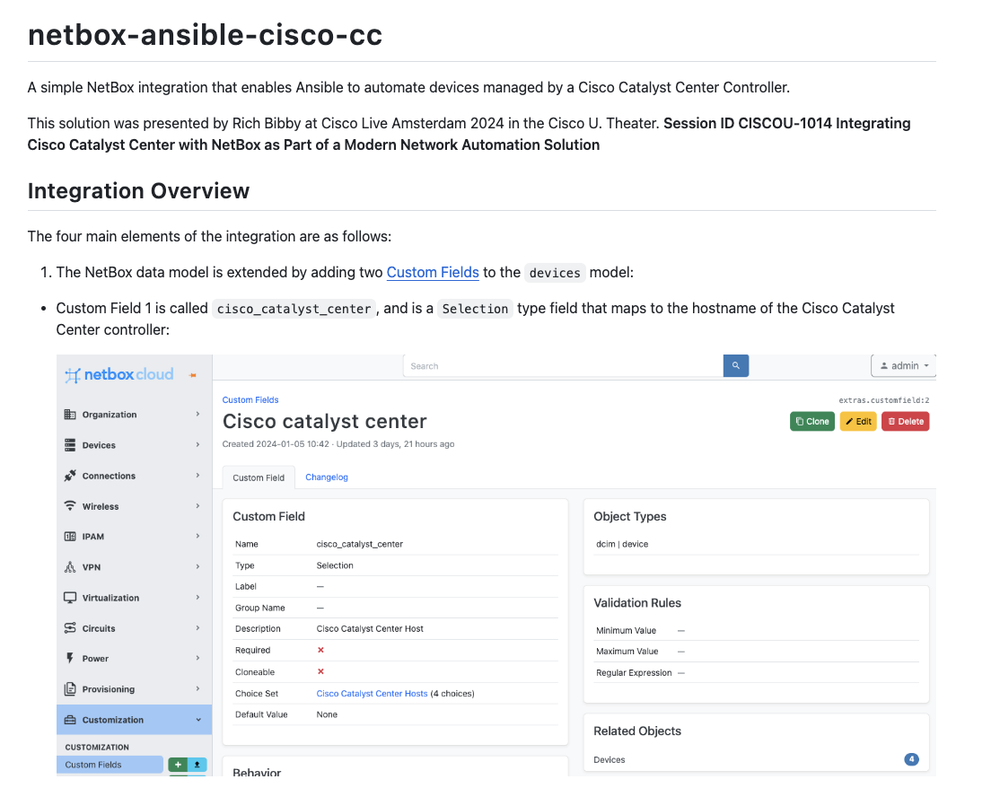

<!--- Do not edit this file directly, generated from a file in .tempaltes --->

# NetBox learning resources
> Resources, tutorials and demos for NetBox from [NetBox Labs](https://www.netboxlabs.com/).

## 🧑🏻‍🏫 Tutorials and webinars

### Netbox <> Cisco Catalyst Centre integration with Ansible

[README.md](netbox-ansible-cisco-cc/README.md)

A simple NetBox integration that enables Ansible to automate devices managed by a Cisco Catalyst Center Controller.

This solution was presented by Rich Bibby at Cisco Live Amsterdam 2024 in the Cisco U. Theater. Session ID `CISCOU-1014` Integrating Cisco Catalyst Center with NetBox as Part of a Modern Network Automation Solution

### Getting Started with Network Automation: NetBox and Ansible

[README.md](netbox-ansible-webinar/README.md)

This webinar teaches you how to get started with network automation using NetBox and Ansible. This session is tailored for network professionals eager to start automating their networks using these powerful and widely-used tools.

### Getting Started with Nornir and NetBox for Network Automation

[README.md](nornir-netbox-webinar/README.md)

This webinar shows you how to get started on your Network Automation journey with Nornir and NetBox and features the `nornir_netbox` inventory plugin for Nornir.

## 🚛 NetBox OSS releases

- [v3.7.3 - 2024-02-21](https://github.com/netbox-community/netbox/releases/tag/v3.7.3) 🌟
- [v3.7.2 - 2024-02-05](https://github.com/netbox-community/netbox/releases/tag/v3.7.2)
- [v3.7.1 - 2024-01-17](https://github.com/netbox-community/netbox/releases/tag/v3.7.1)
- [v3.7.0 - 2023-12-29](https://github.com/netbox-community/netbox/releases/tag/v3.7.0)
- [v3.6.9 - 2023-12-28](https://github.com/netbox-community/netbox/releases/tag/v3.6.9)

## 📝 Latest blog articles

- [NetBox Labs Introduces NetBox Event Streams: Pioneering Event-Driven Architectures for Network Automation](https://netboxlabs.com/blog/netbox-labs-introduces-netbox-event-streams/) by Mark Coleman.
- [Getting Started With NetBox Reports](https://netboxlabs.com/blog/getting-started-with-netbox-reports/) by Rich Bibby.
- [New NetBox Training Courses Available Today!](https://netboxlabs.com/blog/new-netbox-training-courses-available-today/) by Kris Beevers.
- [Learning from a decade of DevOps: A retrospective at NetDevOps Days New York](https://netboxlabs.com/blog/learning-from-a-decade-of-devops/) by Kiley Nichols.
- [Our Network Discovery and Assurance Partnerships and NetBox Labs’ Big Tent Philosophy](https://netboxlabs.com/blog/our-network-discovery-and-assurance-partnerships/) by Mark Coleman.

## Youtube videos

- [What Does Being the Commercial Steward of NetBox OSS Really Mean?](https://www.youtube.com/watch?v=d5puGly5Owo) In this video, NetBox Labs Co-founder and CEO Kris Beevers shares why supporting and growing the NetBox community is a top priority at NetBox Labs and what being the commercial steward of NetBox OSS r... 

- [NetBox v3.7: Event Rules](https://www.youtube.com/watch?v=eavpywH0LfY) In this video we are going to look at a great new feature that was added in NetBox version 3.7, called Event Rules. which can be used to send Webhooks or execute custom scripts automatically in respon... 

- [NetBox v3.7: VPN tunnels](https://www.youtube.com/watch?v=l72Mbopu_gQ) In this video I will show you how you can model your VPN tunnels in NetBox, using a great new feature that was added in NetBox version 3.7 NetBox can now model private tunnels formed among virtual ter... 

- [Working with NetBox Cloud Database Backups](https://www.youtube.com/watch?v=1YnQhsC6KFQ) Within the NetBox Labs Console you can access the backups of your NetBox Cloud database, and are able to perform the following actions:

- View a list of all available database backups
- Take an 'On D... 

- [NetBox Heroes Episode 8: Garrett Nowak - 11:11 Systems](https://www.youtube.com/watch?v=RHfJJpNADu4) In this episode of NetBox Heroes, Host Kris Beevers discusses the importance of mentorship, including team culture as a part of onboarding, and making mistakes, with Garret Nowak, senior director of n... 

## Get involved

Join the <NetDev> Community Slack - https://netdev.chat/

Attend a Netbox Community call - xxx