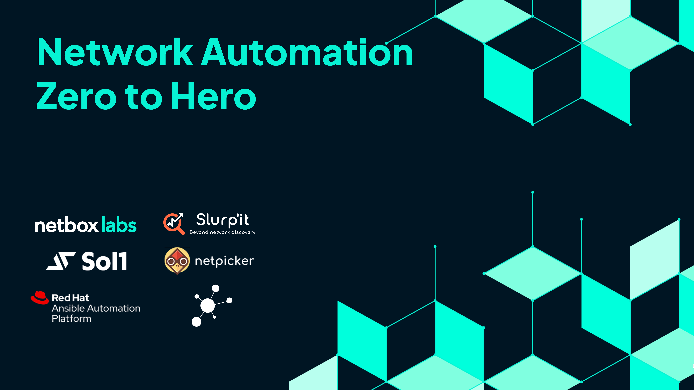

# Autocon2 NetBox Automation Workshop

Welcome to the Autocon2 NetBox Automation Workshop! In this workshop we will build a fully functioning intent-based network automation stack. While most vendors do a great job of showing you how to use their tool, network automation is a multi-tool adventure and there is lack of tutorials and documentation showing how everything fits together.

This workshop is intended to teach you the high-level concepts around intent-based networking, while also delivering you a fully functioning stack you can continue to experiment with. The workshop is split into sections covering different elements of the story. You should follow them sequentially.

> [!TIP]
>   
> You can view the deck that is used throughout the videos here: [Network Automation Zero to Hero Deck](https://netboxlabs.com/wp-content/uploads/2024/12/Network-Automation-Zero-to-Hero-Deck.pdf)  

## Introduction Video (Click to launch :rocket:)

---

## Installation
- [Installation](docs/Installation.md) - Getting set up to follow the rest of the guide

## Modules

1. [Managing Networks the Hard Way](docs/1_Managing_Networks_The_Hard_Way.md) - A look at a "traditional" network management stack, and some of its drawbacks
2. [Introducing Intent-Based Network Automation](docs/2_Introducing_Intent_Based_Network_Automation.md) - A brief introduction to the high-level concepts that we'll be building through the rest of the workshop.
3. [Source of Truth: NetBox](docs/3_Source_Of_Truth_NetBox.md) - An introduction to NetBox, our Network Source of Truth that will drive our intent-based networking
4. [Discovery and Reconcilliation: Slurpit](docs/4_Discovery_Reconciliation_Slurpit.md) - An introduction to the concepts of discovery and reconciliation with Slurpit
5. [Monitoring: Icinga](docs/5_Monitoring_Icinga.md) - An introduction to how monitoring can be made significantly easier when using intent based network automation
6. [Configuration Assurance: Netpicker](docs/6_Configuration_Assurance_Netpicker.md) - A look at how configuration assurance in Netpicker can be driven by our intent in NetBox
7. [Automated Network Changes: Ansible](docs/7_Automated_Network_Changes_Ansible.md) - Pushing updates to the network, using Ansible
8. [Summary](docs/8_Summary.md) - A final recap of what we've learned