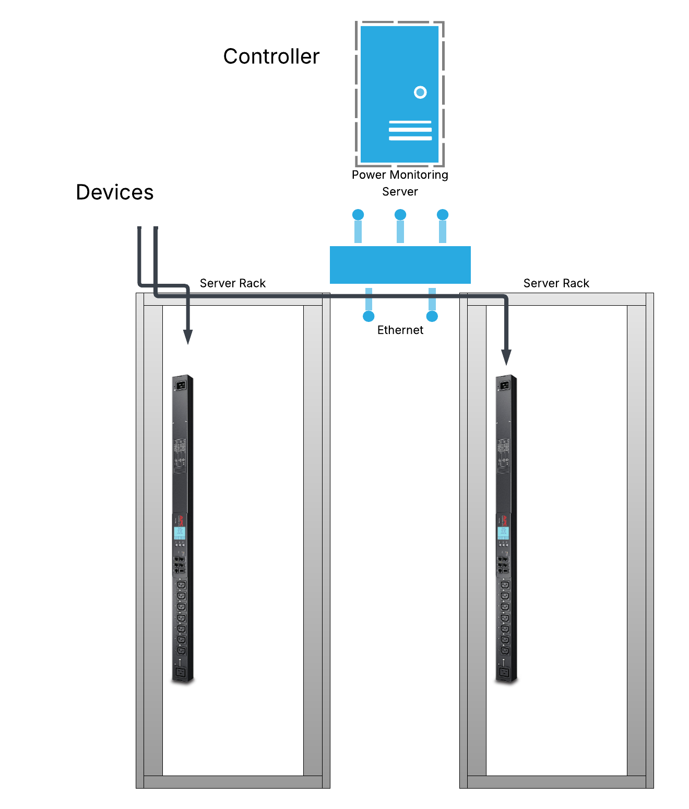
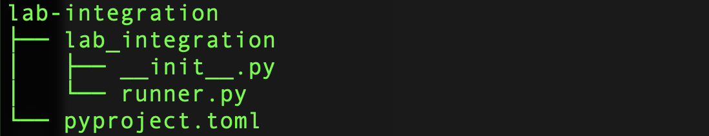
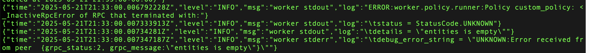
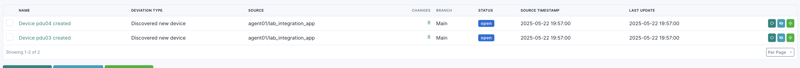
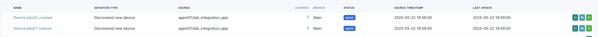

# Building Your Own Controller Integration

This section demonstrates how to use Orb extensibility to add custom backends. Participants will learn how to import data from a local CSV file and a remote API endpoint.


## About our controller data

Our controller is based upon a PDU (power) monitoring system within a datacentre.  The PDU devices aren't currently in NetBox but are within our controller. 



The aim of the integration is to pull data into NetBox via an Orb agent either from a CSV file, or, via the API of the controller via creating a python package.

## Instructions 

>[!IMPORTANT]
>
> This guide assumes you have the environmental variables DIODE_CLIENT_ID and DIODE_CLIENT_SECRET are set

### 1. Project Skeleton

 In our terminal change directory to one including skeleton project and run `ls` to see the files

``` 
cd code/step-1/
ls -R lab-integration
```

#### 1.1. Directory Structure

Orb integrations are effectively Python packages extending the `Backend` class from the orb agent. Let's start by looking at a skeleton project.

 Our directory `lab-integration` is our project directory, containing a metadata file, underneath which we have a `lab_integration` directory containing our code.




#### 1.2. Files
##### 1.2.1 pyproject.toml

 The `pyproject.toml` file describes the project and allows Python to extract metadata and any requirements to build the package. 
 
Let's complete our pyproject.toml file by completing the NAME and email sections 

**=== ACTION ===**

  Open `lab-integration/pyproject.toml` in VS Code and change `<YOUR NAME>` and `<YOUR EMAIL>` to your own details. Then Save the file.

```python
[project]
name = "lab-integration"
version = "1.0.0"  # Overwritten during the build process
description = "Worker to import data from a custom integration"
readme = "README.md"
requires-python = ">=3.10"
license = { text = "Apache-2.0" }
authors = [
    {name = "<YOUR NAME>", email = "<YOUR EMAIL>" }
]
maintainers = [
    {name = "<YOUR NAME>", email = "<YOUR EMAIL>" }
]
```

##### 1.2.2 lab_integration/\_\_init\_\_.py

 In this file we import our class from the `runner.py` file and tell Python which class to run

```python
#!/usr/bin/env python
#

from lab_integration.runner import LabIntegration

__all__ = ["LabIntegration"]
```

##### 1.2.3 lab_integration/runner.py

 In this file we declare our main code:
 * a class (`LabIntegration`) extending the `Backend` class from the worker.backend
 * 2 methods in the class:
    * a setup function (declaring metadata)
    * a run function, which should always return a list of Entities

```python
#!/usr/bin/env python

from collections.abc import Iterable
from netboxlabs.diode.sdk.ingester import Entity
from worker.backend import Backend
from worker.models import Metadata, Policy


class LabIntegration(Backend):

    def setup(self) -> Metadata:
        return Metadata(name="lab_integration", app_name="lab_integration_app", app_version="1.0.0")

    def run(self, policy_name: str, policy: Policy) -> Iterable[Entity]:
        ''' this function should always return an Entities list '''
        entities = []
        return entities
```

#### 1.3 - Testing our skeleton

 In order to test our skeleton, we'll need to do a few things

 * Update our `agent.yaml` to include our target ip
 * create a `workers.txt` file telling orb where to locate the worker
 * create an environmental variable to tell orb where to import workers from

**=== ACTION ===**

  Open `agent.yaml` in VS Code and replace `<YOUR INFRA IP>` with your Diode IP Address, then save

```yaml
        target: grpc://<YOUR INFRA IP>:8080/diode
```
**=== ACTION ===**

 Use VS Code to create a file named `workers.txt` and paste the below into that file then save

```
./lab-integration
```

>[!TIP]
>
> workers.txt can include local file paths, tar.gz python packages, or pypi package links


**=== ACTION ===**

 Finally, set our environmental variable by pasting the below into your terminal

```bash
export INSTALL_WORKERS_PATH=/opt/orb/workers.txt
```

 We're now ready to run the orb agent, paste the below into your terminal and hit enter

  ```bash
docker run -e DIODE_CLIENT_SECRET -e DIODE_CLIENT_ID -e INSTALL_WORKERS_PATH -u root -v $(pwd):/opt/orb/ netboxlabs/orb-agent:latest run -c /opt/orb/agent.yaml
```
 


 and look for these lines

 

 Congratulations! Our Custom Worker has been run!

 Control-C to exit the docker environment

### 2. adding CSV support

 To add CSV support to our integration, we'll need to perform a few tasks

 * Create the CSV file 
 * Specify the CSV filename and method via environmental variables
 * Code: Read the CSV File
 * Code: Transform this to Diode.


**=== ACTION ===**

  Change directory to step-2

  ```cd ../step-2```
  

#### 2.1. Create the CSV File

 Firstly, let's create our CSV.  Using VS Code, create a file named `our_data.csv` and paste the below into that file, then Save

```csv
name,manufacturer,model,management_ip,serial
pdu03,APC,APC6732,10.163.3.3,345678
pdu04,APC,APC6734,10.163.3.4,456789
```

#### 2.2. Setup Environmental variables

 Firstly, export our CSV_FILENAME and METHOD as environmental variables:

```bash
export CSV_FILENAME="/opt/orb/our_data.csv"
export METHOD="csv"
```

 Secondly, modify our `agent.yaml` to reference these variables  by adding `csv_filename` and `method` variables under `custom_config`.  

**=== ACTION ===**

 * Open VS Code and edit `agent.yaml` to include the csv_filename and method variables, as shown below.

 * Remember to update `<YOUR INFRA IP>` with your IP Address.

 * Save the file

```yaml
orb:
  backends:
    worker:
      host: 0.0.0.0
    common:
      diode:
        target: grpc://YOUR INFRA IP>:8080/diode
        client_id: ${DIODE_CLIENT_ID}
        client_secret: ${DIODE_CLIENT_SECRET}
        agent_name: agent01
  policies:
    worker:
      custom_policy:
        config:
          package: lab_integration
          schedule: "* * * * *"
          custom_config: custom
          csv_filename: ${CSV_FILENAME}
          method: ${METHOD}
        scope:
          custom: any  
```

#### 2.3 - Examine Code

  In VS Code open our `lab-integration/lab_integration/runner.py` file and look for the `load_from_csv` function. In this function we use `DictReader` from the `csv` library to read from our file into a Python `list`. 

  We do this so we can use one function to transform to Diode by ensuring both our CSV function and API functions return data in the same format.


```python
    def load_from_csv(self, filename: str) -> list:
        ''' function to read a csv file and return it as a list '''
        pdu_list = []

        ''' read the csv file and look through creating a dict for each row, then append to our list '''
        with open(filename, newline='') as csvfile:
            ''' use a dict reader so we can reference via column names '''
            reader = csv.DictReader(csvfile)
            for row in reader:
                pdu = {
                    'name': row['name'],
                    'serial': row['serial'],
                    'model': row['model'],
                    'manufacturer': row['manufacturer'],
                    'management_ip': row['management_ip']
                }
                pdu_list.append(pdu)
        return pdu_list
```

 Now let's look at how we ingest this to Diode by looking at the `transform_to_diode` function:

>[!IMPORTANT]
> 
> The Diode SDK includes classes for most common NetBox Objects. In order to ingest to Diode we need to create instances of these objects, then create Entities from them specifying the type e.g. ` entity = Entity(device=Device(name="router1"))`

 ```python
    def transform_to_diode(self, pdu_list: list) -> list:
        entities = []
        ''' loop through our pdu_list and create an entity for each, adding to a list '''
        for pdu in pdu_list:
            ''' create Device Entity, an IP Address and an Interface '''
            device = Device(
                name = pdu['name'],
                device_type=pdu['model'],
                manufacturer=pdu['manufacturer'],
                site='Prague',
                role='pdu',
                serial=pdu['serial'],
                status='active',
                primary_ip4=IPAddress(
                    address=pdu['management_ip'],
                    status='active',
                    description='loaded from csv',
                    assigned_object_interface=Interface(
                        name='eth0',
                        type='1000base-t',
                        device=Device(
                            name = pdu['name'],
                            device_type=pdu['model'],
                            manufacturer=pdu['manufacturer'],
                            site='Prague',
                            role='pdu',
                            serial=pdu['serial'],
                            status='active',
                        )
                    )
                )
            )

            entities.append(Entity(device=device))
        return entities
```


#### 2.4 - Testing CSV ingestion

 Finally, let's re-run our containers - note the additional environmental variables `CSV_FILENAME` and `METHOD`

**=== ACTION ===**

 In our terminal, run the below command 

```bash
docker run -e DIODE_CLIENT_SECRET -e DIODE_CLIENT_ID -e INSTALL_WORKERS_PATH -e CSV_FILENAME -e METHOD -u root -v $(pwd):/opt/orb/ netboxlabs/orb-agent:latest run -c /opt/orb/agent.yaml
```

 Finally, in NetBox Assurance, review the deviations and choose to apply or not.  (You should see `pdu03` and `pdu04`.)




### 3. Adding Controller API Support

 To add controller API support to our integration, we'll need to perform a few tasks

* Add environment variables for our API URL + Token
* Write a function to read the data from our API
* Conditionally call the CSV read or API read depending on conditions (we'll use the CSV filename being set)

**=== ACTION ===**

  Change directory to step-3

  ```cd ../step-3```
  
#### 3.1. Set Environmental Variables

**=== ACTION ===**

  export our environmental variables below - note, these endpoints are already configured

```bash
export CONTROLLER_URL="http://autocon3-master.netboxlabs.tech/api/plugins/dummycontroller/pdus/"
export CONTROLLER_TOKEN="2aa034ecf77d9c6c8337690e058091e11ad4df9c"
export METHOD="api"
```

 Secondly, modify our `agent.yaml` to reference these variables  by adding `controller_url` and `controller_token` variables under `custom_config`.  

**=== ACTION ===**

 * Open VS Code and edit `agent.yaml` to include the `controller_url` and `controller_token` variables, as shown below.

 * Remember to update `<YOUR INFRA IP>` with your IP Address.

```yaml
orb:
  backends:
    worker:
      host: 0.0.0.0
    common:
      diode:
        target: grpc://<YOUR INFRA IP>:8080/diode
        client_id: ${DIODE_CLIENT_ID}
        client_secret: ${DIODE_CLIENT_SECRET}
        agent_name: agent01
  policies:
    worker:
      custom_policy:
        config:
          package: lab_integration
          schedule: "* * * * *"
          custom_config: custom
          csv_filename: ${CSV_FILENAME}
          method: ${METHOD}
          controller_url: ${CONTROLLER_URL}
          controller_token: ${CONTROLLER_TOKEN}
        scope:
          custom: any  
```

#### 3.3. API Data

 Let's look at what our API returns 

**=== ACTION ===**

 Run the below in your terminal

```bash
curl $CONTROLLER_URL -H "Authorization: Token ${CONTROLLER_TOKEN}" | jq
```

 Let's look at the data returned, we'll need to process this data 

```json
[
  {
    "name": "pdu01",
    "model": "AP5978",
    "manufacturer": "APC",
    "total_load": "13.1A",
    "management_ip": "10.163.1.1/24",
    "serial": "123456"
  },
  {
    "name": "pdu02",
    "model": "APC958",
    "manufacturer": "APC",
    "total_load": "11.1A",
    "management_ip": "10.163.1.2/24",
    "serial": "23457"
  }
]
```

#### 3.4. Examine Code

  In VS Code open our `lab-integration/lab_integration/runner.py` file and look for the `load_from_controller` function.  In this function we use DictReader from the csv library to read from our file into a python `list`. 

  We use the `requests` library to get the initial list, then recursively call the endpoint again with the added `?name=` parameter to get more information, again returning a python `list`
  
```python

    def load_from_controller(self, controller_url: str, controller_token: str) -> list:
        ''' function to read from the controller and return a list '''
        pdu_list = []
        names = []
        headers = {'Authorization': f'Token {controller_token}' }
        r = requests.get(controller_url, headers=headers)
        ''' get the brief list '''
        if r.status_code == 200:
            for item in r.json():
                names.append(item["name"])
        ''' loop through the brief list to get the individual pdus '''
        for name in names:
            iurl = f'{controller_url}?name={name}'
            r = requests.get(iurl, headers=headers)
            if r.status_code == 200:     
                pdu_list.append(r.json())

        return pdu_list

```


#### 3.5. Running

  Finally, let's run our code ...

**=== ACTION ===**

 In our terminal, run the below command - note the additional enviromental variables `CONTROLLER_TOKEN` and `CONTROLLER_URL`

```bash
docker run -e DIODE_CLIENT_SECRET -e DIODE_CLIENT_ID -e INSTALL_WORKERS_PATH -e CONTROLLER_TOKEN -e CONTROLLER_URL -e CSV_FILENAME -e METHOD -u root -v $(pwd):/opt/orb/ netboxlabs/orb-agent:latest run -c /opt/orb/agent.yaml
```

  Finally, in NetBox Assurance, review the deviations and choose to apply or not.
 
