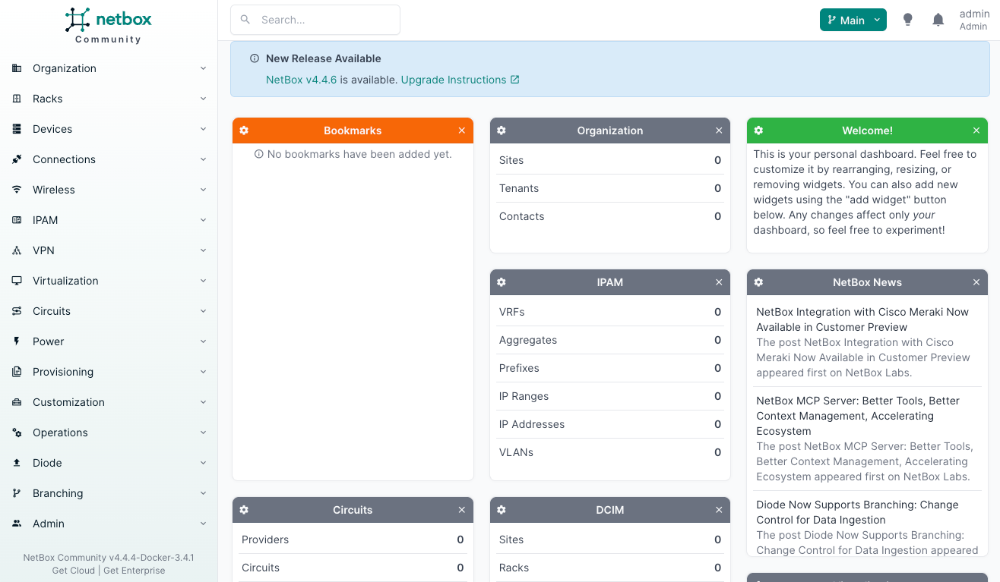
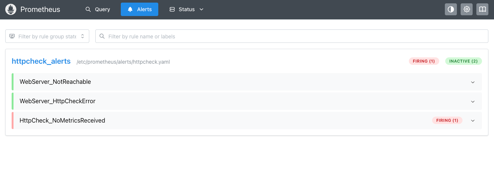
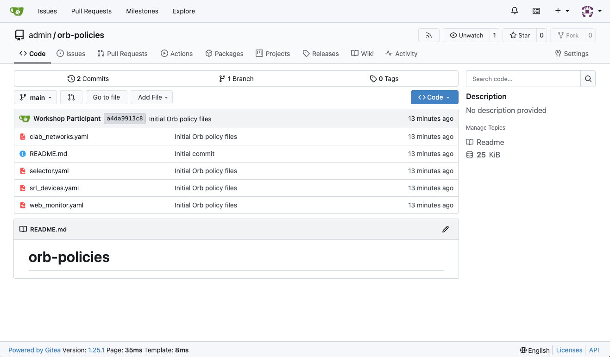

# Module 0: Introduction & Setup

Welcome to the NetBox Labs AutoCon4 Workshop! This hands-on workshop will guide you through building a complete, self-correcting network automation solution using modern tooling and best practices.

## What You'll Learn Today

By the end of this workshop, you will:

- **Understand Closed-Loop Network Automation**: Learn what it means and why building feedback loops is key to creating stable, self-correcting network automation solutions
- **Master the Network Source of Truth**: Discover why an accurate source of truth is a requirement for any network automation initiative and learn best practices for keeping it current
- **Drive Configuration from Data**: Understand how to generate and deploy device configurations from your source of truth to maintain consistency across your infrastructure
- **Manage Operational Drift**: Learn why drift is inevitable and how managing it is critical to succeeding with network automation
- **Leverage Discovery & Observability**: Use modern tools to identify current network state and build self-correcting automation systems

## Workshop Structure

This workshop is organized into progressive modules, each building on the previous one:

| Module | Topic | What You'll Do |
|--------|-------|----------------|
| **Module 0** | Introduction & Setup | Get oriented with the lab environment and tooling |
| **Module 1** | [Manual Configuration](../module_1/README.md) | Experience the pain of manual network configuration |
| **Module 2** | [Observability](../module_2/README.md) | Set up monitoring to detect network issues automatically |
| **Module 3** | [Discovery & Baseline](../module_3/README.md) | Use NetBox Discovery to document your network |
| **Module 4a** | [Network Modeling (Basic)](../module_4a/README.md) | Model your network design in NetBox |
| **Module 4b** | [Network Modeling (Advanced)](../module_4b/README.md) | Advanced data modeling techniques |
| **Module 5** | [Automated Configuration](../module_5/README.md) | Deploy configurations automatically via Ansible |
| **Module 6** | [Validation & Drift](../module_6/README.md) | Detect and correct configuration drift |

## Understanding Closed-Loop Network Automation

Traditional network automation often looks like this:

```
┌─────────────┐      ┌─────────────┐      ┌─────────────┐
│   Source    │ ───> │ Automation  │ ───> │  Network    │
│  of Truth   │      │   Engine    │      │  Devices    │
└─────────────┘      └─────────────┘      └─────────────┘
```

This is **open-loop automation**: you push configurations out, but you don't verify the result or detect when things change.

**Closed-Loop Network Automation** adds critical feedback mechanism:

```
    ┌─────────────┐                    ┌─────────────┐
    │   NetBox    │ ─────Deploy──────> │   Ansible   │
    │  (Source of │                    │             │
    │   Truth)    │                    └──────┬──────┘
    └─────────────┘                           │
           ▲                                  │
           │                                  │
           │                                  ▼
           │                         ┌─────────────────┐
           │                         │    Network      │
           │                         │    Devices      │
           │                         └─────────────────┘
           │                                  │
           │                                  │
           │                                  ▼
           │                         ┌─────────────────┐
           │                         │   Orb Agent     │
           │   Discovery +           │  (Discovery &   │
           └─────Observability───────│ Observability)  │
                  Feedback           └─────────────────┘
```

Discovery feedback loop detects configuration drift and unauthorized changes, while observability feeback loop detects connectivity issues, performance degradation, service outages.

### Why Closed Loops Matter

1. **Detect Drift**: Networks change—manual changes, failures, misconfigurations. Discovery tools detect these changes.
2. **Verify Success**: Observability confirms your automation actually worked.
3. **Self-Healing**: When drift is detected, automation can reconcile the network back to the desired state.
4. **Continuous Compliance**: Instead of periodic audits, your system continuously validates compliance.

### The Role of Source of Truth

NetBox serves as the **single source of truth** for your network:

- **Inventory**: What devices exist, their roles, locations, connections
- **IP Management**: IP addressing, VLANs, prefixes
- **Configuration Intent**: The desired state you want to maintain
- **Relationships**: How everything connects together

When NetBox is accurate and current, your automation can trust the data. When it's stale, automation becomes dangerous.

## Your Lab Environment

Your workshop environment includes a complete network automation stack. All services are pre-configured and ready to use.

### Architecture Overview

```
                    ┌───────────────────────────────┐
                    │     Your Lab Environment      │
                    │                               │
                    │  ┌──────────┐   ┌──────────┐  │
                    │  │   srl1   │───│   srl2   │  │  Network Devices
                    │  │ (Nokia)  │   │ (Nokia)  │  │  (ContainerLab)
                    │  └────┬─────┘   └─────┬────┘  │
                    │       │               │       │
                    │  ┌────┴───────────────┴────┐  │
                    │  │    Orb Agent            │◄─┼──┐
                    │  │ (Discovery & Observ.)   │  │  │
                    │  └──┬────────────────┬─────┘  │  │
                    │     │                │        │  │
                    │     │ Discovery      │Metrics │  │ Policies
                    │     ▼                ▼        │  │
                    │  ┌──────────┐  ┌───────────┐  │  │
                    │  │  NetBox  │  │Prometheus │  │  │
                    │  │ + Diode  │  │           │  │  │
                    │  └────┬─────┘  └───────────┘  │  │
                    │       │                       │  │
                    │       │ Configs               │  │
                    │       ▼                       │  │
                    │  ┌──────────┐  ┌───────────┐  │  │
                    │  │ Ansible  │  │  Gitea    │──┼──┘
                    │  │          │  │           │  │
                    │  └──────────┘  └───────────┘  │
                    │                               │
                    └───────────────────────────────┘
```

## The Tools in Your Stack

### NetBox - Network Source of Truth

NetBox is an open-source application designed to empower network automation. It serves as your single source of truth for network infrastructure.

We'll be using NetBox to:
- Document network devices and interfaces
- Manage IP addressing (IPAM)
- Define configuration templates

**Access Information:**
- URL: `http://$MY_EXTERNAL_IP:8000`
- Username: `admin`
- Password: `admin`

> [!TIP]
> To find your URL, run: `echo "http://$MY_EXTERNAL_IP:8000"`



**Key Features for This Workshop:**
- **Device Inventory**: Track all network devices and their attributes
- **Configuration Contexts**: Store device-specific configuration data
- **Branching Plugin**: Test changes in branches before merging to production

### Diode - Network Discovery & Data Ingestion

Diode is a NetBox ingestion service. It receives network data from the Orb agent and other sources, then ingests that data into NetBox. This creates a feedback loop where NetBox isn't just a static inventory—it's continuously updated with actual network state.

We'll be using Diode to:
- Ingest network state and inventory data into NetBox
- Keep NetBox synchronized with network reality
- Validate that deployed configurations match intent

### Orb - Network Discovery & Observability Agent

[Orb agent](https://github.com/netboxlabs/orb-agent) is an open-source discovery & observability agent that gathers network inventory data, collects metrics, and can perform health checks on your network.

We'll be using Orb agent to:
- Discover device inventory and configuration
- Run HTTP health checks (is the web server reachable?)
- Continuous validation of network connectivity

**Dynamic Configuration via Git:**
In this workshop, the Orb agent is configured to dynamically fetch its monitoring policies from Gitea. This means:
- You can update monitoring policies by committing changes to Git (or directly in Gitea)
- The agent polls Gitea periodically and applies new policies automatically
- No need to restart the agent when monitoring requirements change

### Ansible - Automation Engine

Ansible is an open-source automation platform that can configure systems, deploy software, and orchestrate complex workflows.

We'll be using Ansible to:
- Deploy configurations rendered in NetBox to network devices

### Prometheus - Metrics & Alerting

Prometheus is an open-source timeseries database (TSDB) with a powerful query language and alerting capabilities.

We'll be using Prometheus to:
- Collect monitoring metrics from Orb agent
- Create alerts for network issues
- Visualize historical metrics

**Access Information:**
- URL: `http://$MY_EXTERNAL_IP:9090`
- No authentication required

> [!TIP]
> To find your URL, run: `echo "http://$MY_EXTERNAL_IP:9090"`



### Gitea - Git Server & Configuration Source

Gitea is a lightweight, self-hosted Git service (like GitHub, but running in your lab).

We'll be using Gitea to:
- Store and serve monitoring policies that will be dynamically fetched by Orb agent

Orb agent uses a `selector.yaml` file in the repository to determine which policies apply to which agents based on labels, and automatically applies or removes policies as they're updated in Git.

**Access Information:**
- URL: `http://$MY_EXTERNAL_IP:3000`
- Username: `admin`
- Password: `admin123`

> [!TIP]
> To find your URL, run: `echo "http://$MY_EXTERNAL_IP:3000"`



### ContainerLab - Network Emulation

ContainerLab is a tool for creating network topologies using containers, supporting various network operating systems.

We'll be using ContainerLab to:
- Run Nokia SR Linux devices in containers
- Create realistic network topologies
- Test automation safely before production deployment
- Rapidly build and tear down lab environments

**In This Workshop:**
Your lab runs two Nokia SR Linux devices (`srl1` and `srl2`) connected to each other, an Orb agent, and a web server. This gives us a realistic network to automate.

## Understanding the Workshop Flow

Here's how the modules connect to build a complete automation solution:

### Phase 1: Establish Baseline (Modules 1-3)
1. **Module 1**: Manually configure the network to feel the pain
2. **Module 2**: Set up observability to monitor network health
3. **Module 3**: Use discovery to document the current network state in NetBox

### Phase 2: Define Intent (Module 4)
4. **Module 4**: Model your desired network state in NetBox (your source of truth)

### Phase 3: Automate & Validate (Modules 5-6)
5. **Module 5**: Deploy configurations automatically using Ansible
6. **Module 6**: Detect drift and use automation to self-correct

By the end, you'll have a system where:
- NetBox defines the desired state
- Ansible deploys that state to devices
- Discovery validates the deployment
- Observability monitors ongoing health
- The system automatically corrects drift

This is **Closed-Loop Network Automation** in action.

## Key Concepts to Remember

Before diving into the modules, keep these concepts in mind:

### Source of Truth First
Your automation is only as good as your data. NetBox must accurately reflect your intended network state. Garbage in = garbage out.

### Automation is Declarative
You declare **what** you want (the desired state), not **how** to achieve it. Ansible and modern configuration tools handle the "how."

### Embrace Idempotency
Running automation multiple times should have the same effect as running it once. This makes automation safe and predictable.

### Feedback is Essential
Without discovery and observability, you can't know if automation worked or if drift occurred. Closed-loop systems require feedback.

### Start Small, Scale Gradually
In production, start with low-risk devices and expand as you gain confidence. This workshop compresses that timeline, but the principle remains.

## What's Next?

Now that you're familiar with the lab environment and the concepts behind Closed-Loop Network Automation, you're ready to begin!

In **Module 1**, you'll experience the traditional way of configuring networks by manually SSHing into devices. This will help you appreciate why automation is so valuable—and why doing it right (with feedback loops) is critical.

---

**Continue to:** [Module 1 - Configuring the network the old fashioned way](../module_1/README.md)