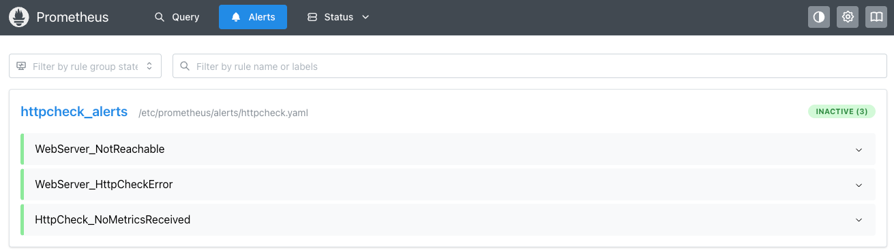
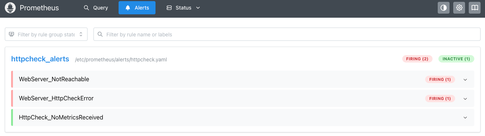
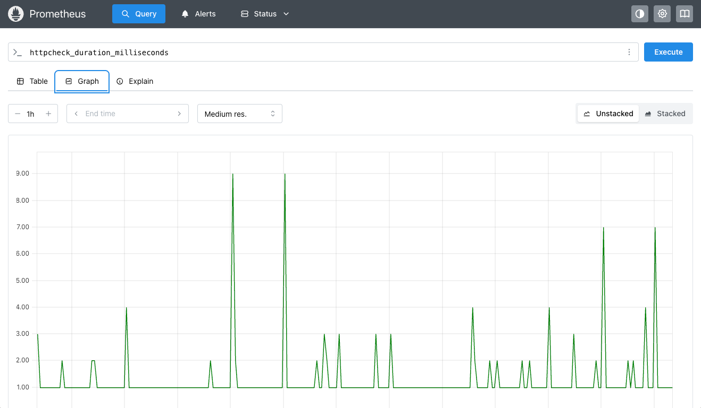

# Module 2: Observability in Support of Network Automation

## Overview

In the previous exercise we used `ping` to confirm our work, but what if we want to see what's going on the whole time? What if multiple people are making changes to the network? How do we know when something went wrong—and more importantly, how do we know before our users do?

This is where observability comes in. In fact, we've actually been running observability in the background this whole time. Let's see how you did in Module 1!

## Learning Objectives

By the end of this module, you will:

- Understand the role of observability in network automation workflows
- Learn how Orb provides network monitoring and telemetry
- Use Prometheus to visualize network health and alerts
- Understand how observability catches issues proactively
- See the connection between NetBox as a source of truth and monitoring configuration

## What is Orb agent?

[Orb agent](https://github.com/netboxlabs/orb-agent) is an open-source observability platform designed for modern networks. In our lab environment, the Orb agent performs several critical functions:

- **Device Discovery**: Gathers configuration data from network devices (see next [module](../module_3/README.md))
- **Monitoring**: Runs health checks against network endpoints
- **Prometheus Integration**: Exposes metrics in Prometheus format for visualization and alerting

The Orb agent is already running in your lab environment, monitoring your network and making that data available to Prometheus. Let's see what it's been tracking.

## Lab Network Topology

Here's a visual representation of our lab network, showing how the Orb agent monitors the web server:

```
┌──────────────────┐                             ┌──────────────────┐
│   Orb Agent      │                             │   Web Server     │
│                  │                             │                  │
│  (Monitoring)    │                             │    (Target)      │
└────────┬─────────┘                             └────────┬─────────┘
         │ 192.168.1.2/30                                 │ 192.168.2.2/30
         │                                                │ 
         │ 192.168.1.1/30                                 │ 192.168.2.1/30
         │ ethernet-1/2                                   │ ethernet-1/2
┌────────┴─────────┐             OSPF            ┌────────┴─────────┐
│      srl1        │            Area 0           │      srl2        │
│                  │◄───────────────────────────►│                  │
│   Router ID:     │ 10.0.0.1/30     10.0.0.2/30 │   Router ID:     │
│    1.1.1.1       │ ethernet-1/1   ethernet-1/1 │    2.2.2.2       │
└──────────────────┘                             └──────────────────┘
```

### How Orb Monitors the Network

The Orb agent (192.168.1.2) is positioned on the srl1 side of the network. It performs HTTP health checks against the web server (192.168.2.2), which requires:

1. **Working OSPF**: srl1 and srl2 must have OSPF adjacency
2. **Proper Routing**: The 192.168.2.0/30 subnet must be advertised via OSPF
3. **Interface Configuration**: All interfaces must be up and configured correctly

This means the Orb agent's monitoring validates the **entire path** through the network:
- srl1's ethernet-1/2 interface (where Orb connects)
- srl1's ethernet-1/1 interface (transit link)
- OSPF routing between devices
- srl2's ethernet-1/1 interface (transit link)
- srl2's ethernet-1/2 interface (web server connection)
- The web server itself

**Why This Matters:** If any component fails (interface down, OSPF broken, web server offline), the Orb agent will detect it and Prometheus will alert you. This is more comprehensive than just pinging from one device.

## Accessing Prometheus

Prometheus is a popular open-source monitoring and alerting toolkit. In our setup, it collects metrics from the Orb agent and evaluates alerting rules.

> [!TIP]
> To find your Prometheus URL, run: `echo "http://$MY_EXTERNAL_IP:9090"`
> No username or password required.

### Viewing the WebServer Reachability Alert

1. Open Prometheus in your browser using the URL above
2. Navigate to **Alerts** in the top menu
3. Click on the **WebServer_NotReachable** alert

You should see the alert rule that checks if the web server is reachable—similar to what we did manually with `ping` in Module 1, but continuously and automatically.

**Alert Status:**
- 🟢 **Green (Inactive)**: You successfully configured the network in Module 1! The web server is reachable.
- 🔴 **Red (Firing)**: The network configuration is broken and the web server cannot be reached.



#### Understanding the Alert Query

```promql
httpcheck_status{http_status_class="2xx",http_url="http://192.168.2.2"} == 0
```

This Prometheus query breaks down as follows:

- `httpcheck_status`: The metric tracking HTTP check results
- `http_status_class="2xx"`: Filters for successful HTTP responses (200-299)
- `http_url="http://192.168.2.2"`: The web server endpoint being monitored
- `== 0`: Triggers when the metric equals 0 (meaning the check is failing)

> [!NOTE]
> If the alert is green, congratulations! If not, don't worry—we're going to reconfigure the network automatically in future steps. First, let's reset the network to its original (unconfigured) state so everyone starts from the same baseline.

## Resetting the Network to Baseline

To ensure everyone starts from the same configuration and to demonstrate observability catching failures, let's reset the network to its original broken state.

> [!TIP]
> If you see the prompt `Are you sure you want to remove all labs listed above? Enter 'y', to confirm or ENTER to abort:`, type `y` and press Enter.

```bash
./7_start_network.sh network/workshop.clab.yaml
```

This script will:
1. Tear down the existing lab environment
2. Rebuild all containers with the baseline configuration
3. Restart the network in its initial (unconfigured) state

After a couple of minutes, you should see the containerlab deployment complete:

```bash
╭──────────────────────────┬──────────────────────────────┬─────────┬────────────────╮
│           Name           │          Kind/Image          │  State  │ IPv4/6 Address │
├──────────────────────────┼──────────────────────────────┼─────────┼────────────────┤
│ clab-workshop-orb-agent  │ linux                        │ running │ 172.24.0.100   │
│                          │ netboxlabs/orb-agent:develop │         │ N/A            │
├──────────────────────────┼──────────────────────────────┼─────────┼────────────────┤
│ clab-workshop-srl1       │ nokia_srlinux                │ running │ 172.24.0.101   │
│                          │ ghcr.io/nokia/srlinux:24.7.2 │         │ N/A            │
├──────────────────────────┼──────────────────────────────┼─────────┼────────────────┤
│ clab-workshop-srl2       │ nokia_srlinux                │ running │ 172.24.0.102   │
│                          │ ghcr.io/nokia/srlinux:24.7.2 │         │ N/A            │
├──────────────────────────┼──────────────────────────────┼─────────┼────────────────┤
│ clab-workshop-web-server │ linux                        │ running │ N/A            │
│                          │ nginx:alpine                 │         │ N/A            │
╰──────────────────────────┴──────────────────────────────┴─────────┴────────────────╯
```

## Verifying Observability is Working

Now let's confirm that our observability stack is properly detecting the broken network state.

> [!TIP]
> Prometheus URL: `echo "http://$MY_EXTERNAL_IP:9090"`
> No username or password required.

### Steps to Verify

1. Navigate back to Prometheus in your browser
2. Click on **Alerts** in the top menu
3. Look for the **WebServer_NotReachable** alert

The alert should now be **red (Firing)**, showing us that:
- The network is no longer functional
- Our observability stack detected the failure automatically
- We didn't need to manually check—the monitoring caught it for us



This demonstrates the power of continuous observability: instead of discovering issues through user reports or manual testing, our monitoring system proactively alerts us to problems.

### Troubleshooting

If the alert doesn't change to red after a minute:

1. **Check Alert Evaluation Time**: Prometheus evaluates alerts periodically. Wait another minute and refresh the page.
2. **Verify Containers are Running**: Run `docker ps` to ensure all containers (especially `clab-workshop-orb-agent`) are in a healthy state.
3. **Check Orb Agent Logs**: Run `docker logs clab-workshop-orb-agent` to see if there are any issues with metric collection.
4. **Confirm the Script Completed**: Ensure the `7_start_network.sh` script finished without errors.

## Exploring Metrics in Prometheus

Beyond just viewing alerts, Prometheus allows us to query and visualize historical metrics. Let's explore some network performance data that Orb has been collecting.

### Accessing the Query Interface

1. In Prometheus, click on **Query** in the top menu
2. You'll see a query box where you can enter PromQL (Prometheus Query Language) expressions

### HTTP Response Times

Let's look at how quickly our web server responds when it's healthy. Enter this query:

```promql
httpcheck_duration_milliseconds{http_url="http://192.168.2.2"}
```

**What this shows:**
- Response time in milliseconds for HTTP checks against the web server
- When the network is working, you'll see response times (typically 1-50ms for local networks)
- When the network is broken, you'll either see no data or response times equivalent to the monitoring timeout settings

> [!TIP]
> Switch to the **Graph** tab (next to Console) to see a time-series visualization. This shows how response times have changed over time.



## Key Takeaways

### Why Observability Matters for Network Automation

Making changes to our network without observability is like flying in the dark. Without proper monitoring, we must rely on:
- Engineers manually checking their work after every change
- Users reporting issues (often the worst way to discover problems)
- Reactive troubleshooting instead of proactive detection

With observability in place, we gain:
- **Continuous visibility** into network health
- **Automated alerting** when things break
- **Historical data** to understand trends and patterns
- **Confidence** to automate, knowing we'll catch issues immediately

### The NetBox Connection

While outside the scope of this workshop, a common pattern we see is for networking teams to **drive their monitoring configuration from NetBox**. Why?

- **Single source of truth**: Network inventory in NetBox becomes the basis for monitoring
- **Avoid duplication errors**: No manual synchronization between inventory and monitoring systems
- **Reduce alert fatigue**: Accurate inventory means accurate alerts
- **Scale automation**: As your network grows in NetBox, monitoring scales automatically

### Learn More

Want to implement NetBox-driven monitoring? Check out our AutoCon2 workshop covering this exact pattern:
- [Monitoring - NetBox + Icinga](https://github.com/netboxlabs/netbox-learning/blob/develop/automation-zero-to-hero/docs/5_Monitoring_Icinga.md)

## What's Next?

In the next module, we'll use NetBox Discovery to automatically discover and document our network infrastructure, building the foundation for data-driven automation.

---

**Continue to:** [Module 3 - Using NetBox Discovery to get a baseline of your network](../module_3/README.md)