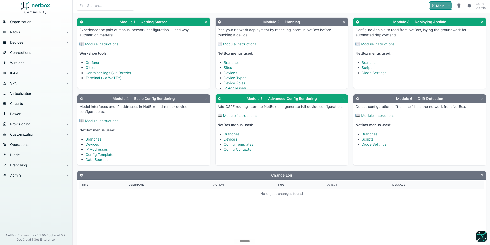
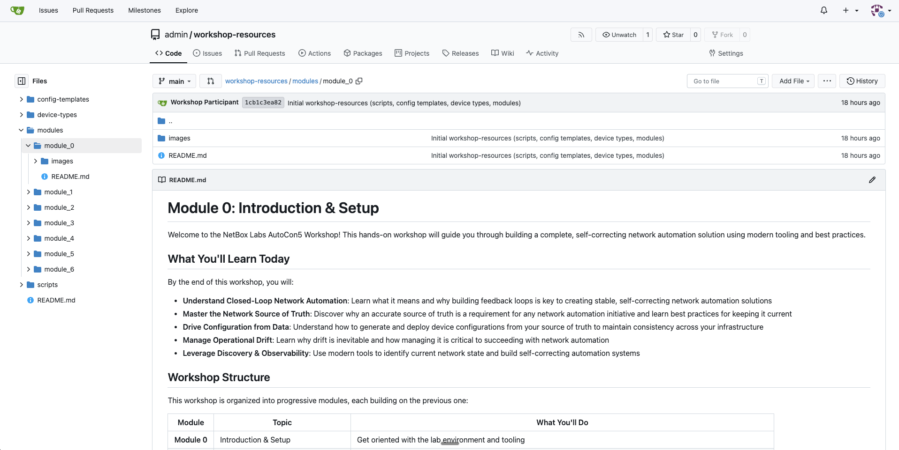
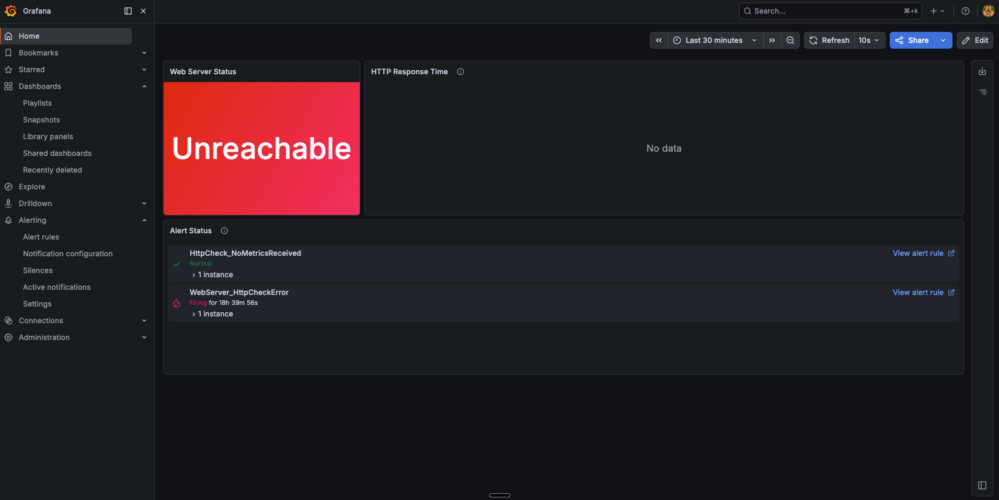
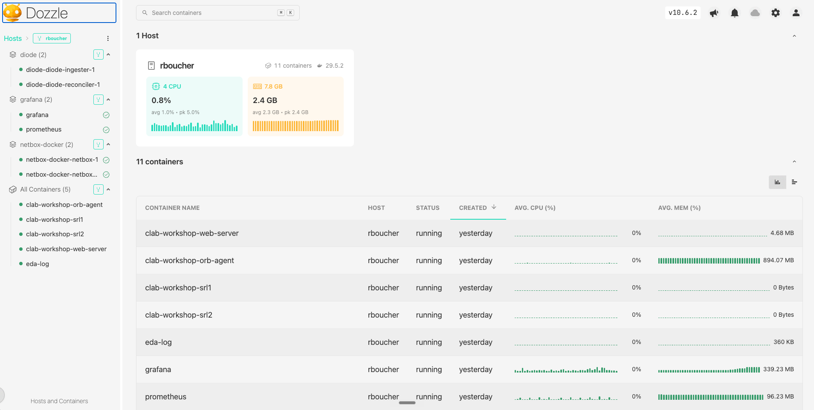

# Module 0: Introduction & Setup

Welcome to the NetBox Labs AutoCon5 Workshop! This hands-on workshop will guide you through building a complete, self-correcting network automation solution using modern tooling and best practices.

## Learning Objectives

By the end of this workshop, you will:

- **Understand Closed-Loop Network Automation**: Learn what it means and why building feedback loops is key to creating stable, self-correcting network automation solutions
- **Master the Network Source of Truth**: Discover why an accurate source of truth is a requirement for any network automation initiative and learn best practices for keeping it current
- **Drive Configuration from Data**: Understand how to generate and deploy device configurations from your source of truth to maintain consistency across your infrastructure
- **Manage Operational Drift**: Learn why drift is inevitable and how managing it is critical to succeeding with network automation
- **Leverage Discovery & Observability**: Use modern tools to identify current network state and build self-correcting automation systems

## Workshop Structure

This workshop is organized into progressive modules, each building on the previous one:

| Module | Topic | What You'll Do |
| ------ | ----- | -------------- |
| **Module 0** | Introduction & Setup | Get oriented with the lab environment and tooling |
| **Module 1** | [Manual Configuration](../module_1/README.md) | Experience the pain of manual network configuration |
| **Module 2** | [Planning Your Deployment in NetBox](../module_2/README.md) | Model intent in NetBox — sites, racks, devices, cables, and IPs in a branch; verify with discovery |
| **Module 3** | [Event-Driven Ansible](../module_3/README.md) | Connect Ansible to NetBox; validate the network against the source of truth; extend the validator with a live playbook edit |
| **Module 4** | [Config Templates & Deployment](../module_4/README.md) | Build a Jinja2 config template; model interfaces and IPs in NetBox; render and deploy device configurations |
| **Module 5** | [Config Contexts & OSPF](../module_5/README.md) | Add OSPF via Config Contexts and Tags; deploy a complete interface + routing configuration from NetBox |
| **Module 6** | [Drift Detection & Self-Healing](../module_6/README.md) | Simulate a rogue change, detect drift with discovery, self-heal by re-deploying intent from NetBox |

## Understanding Closed-Loop Network Automation

Traditional network automation often looks like this:

```text
┌─────────────┐      ┌─────────────┐      ┌─────────────┐
│   Source    │ ───> │ Automation  │ ───> │  Network    │
│  of Truth   │      │   Engine    │      │  Devices    │
└─────────────┘      └─────────────┘      └─────────────┘
```text

This is **open-loop automation**: you push configurations out, but you don't verify the result or detect when things change.

**Closed-Loop Network Automation** adds critical feedback mechanism:

```text
    ┌─────────────┐   Event/Webhook   ┌─────────────┐
    │   NetBox    │ ─────────────────>│ Ansible EDA │
    │  (Source of │                   │  (Rulebook) │
    │   Truth)    │                   └──────┬──────┘
    └─────────────┘                          │ triggers
           ▲                                 ▼
           │                         ┌─────────────┐
           │                         │   Ansible   │
           │                         │  (Playbook) │
           │                         └──────┬──────┘
           │                                │
           │                                │
           │                                ▼
           │                         ┌─────────────────┐
           │                         │    Network      │
           │                         │    Devices      │
           │                         └─────────────────┘
           │                                │
           │                                │
           │                                ▼
           │                         ┌─────────────────┐
           │                         │   Orb agent     │
           │   Discovery +           │  (Discovery &   │
           └─────Observability───────│ Observability)  │
                  Feedback           └─────────────────┘
```

Discovery feedback loop detects configuration drift and unauthorized changes, while observability feedback loop detects connectivity issues, performance degradation, service outages.

### Why Closed Loops Matter

1. **Detect Drift**: Networks change—manual changes, failures, misconfigurations. Discovery tools detect these changes.
2. **Verify Success**: Observability confirms your automation actually worked.
3. **Self-Healing**: When drift is detected, automation can reconcile the network back to the desired state.
4. **Continuous Compliance**: Instead of periodic audits, your system continuously validates compliance.

### The Role of Source of Truth

NetBox serves as the **source of truth** for your network:

- **Inventory**: What devices exist, their roles, locations, connections
- **IP Management**: IP addressing, VLANs, prefixes
- **Configuration Intent**: The desired state you want to maintain
- **Relationships**: How everything connects together

When NetBox is accurate and current, your automation can trust the data. When it's stale, automation becomes dangerous.

## Your Lab Environment

Your workshop environment includes a complete network automation stack. All services are pre-configured and ready to use.

### Your Services at a Glance

> [!NOTE]
> **`<YOUR_ID>`** is the first letter of your first name followed by your last name, all lowercase — for example, Richard Boucher → `rboucher`. Your facilitator will confirm your ID at the start of the session.

**Browser-accessible tools** — open these in tabs and keep them handy throughout the workshop:

| Tool | Purpose | URL |
| --- | --- | --- |
| **NetBox** | Network source of truth — inventory, IP management, config templates, custom scripts | `https://netbox-<YOUR_ID>.autocon5.netboxlabs.tech` |
| **Gitea** | Git server — hosts scripts, config templates, and Orb discovery policies | `https://gitea-<YOUR_ID>.autocon5.netboxlabs.tech` |
| **Grafana** | Observability dashboard — shows network health and fires alerts when connectivity breaks | `https://grafana-<YOUR_ID>.autocon5.netboxlabs.tech` |
| **WeTTY** | Browser terminal — access your VM without a local SSH client | `https://ssh-<YOUR_ID>.autocon5.netboxlabs.tech` |
| **Dozzle** | Docker log viewer — watch EDA, Ansible, and Diode logs in real time | `https://docker-<YOUR_ID>.autocon5.netboxlabs.tech` |

All five use **username `admin` / password `netboxlabs`**.

**Background services** — running on your VM, no browser needed:

| Service | Purpose |
| --- | --- |
| **Ansible + EDA** | Automation engine; EDA listens for NetBox webhooks and triggers Ansible playbooks |
| **Orb agent** | Discovers device inventory and runs HTTP health checks against the web server |
| **Diode** | Receives discovery data from the Orb agent and ingests it into NetBox |
| **ContainerLab** | Runs the two Nokia SR Linux routers (`srl1`, `srl2`) and the web server as containers |

## The Tools in Your Stack

### NetBox — Network Source of Truth

NetBox is an open-source application designed to empower network automation. It serves as your single source of truth for network infrastructure.

We'll be using NetBox to:

- Document network devices and interfaces
- Manage IP addressing (IPAM)
- Define configuration templates

**Key Features for This Workshop:**

- **Device Inventory**: Track all network devices and their attributes
- **Configuration Contexts**: Store device-specific configuration data
- **Branching Plugin**: Test changes in branches before merging to production
- **Custom Scripts**: Run Python scripts inside NetBox to generate policies, trigger automation, and summarise branch changes

> [!TIP]
> **Try it now:** `https://netbox-<YOUR_ID>.autocon5.netboxlabs.tech`
> Log in with **admin** / **netboxlabs**. You should land on the NetBox dashboard showing **— No object changes found —** in the Change Log. That confirms it's empty and ready.



### Gitea — Git Server & Configuration Source

Gitea is a lightweight, self-hosted Git service (like GitHub, but running in your lab).

We'll be using Gitea to:

- Store the `workshop-resources` repository — the scripts, config templates, and device type definitions that NetBox syncs and runs
- Store the `ansible-playbooks` repository — the Ansible playbooks and EDA rulebook that automate device configuration and network validation
- Store the `orb-policies` repository — the discovery policy files fetched by the Orb agent

> [!TIP]
> **Try it now:** `https://gitea-<YOUR_ID>.autocon5.netboxlabs.tech`
> Log in with **admin** / **netboxlabs**. You should see the `admin/workshop-resources`, `admin/ansible-playbooks`, and `admin/orb-policies` repositories listed on the dashboard.



### Grafana — Observability Dashboard

Grafana is an open-source visualisation and alerting platform. In this workshop it provides a pre-built dashboard — **Workshop Network Observability** — with a **Web Server Status** panel that shows whether the network path from the Orb agent to the web server is up or down. The Orb agent continuously performs HTTP health checks and feeds metrics into Grafana; once the network is configured and traffic is flowing, the panel turns green — and goes red again the moment something breaks.

> [!TIP]
> **Try it now:** `https://grafana-<YOUR_ID>.autocon5.netboxlabs.tech`
> Log in with **admin** / **netboxlabs**. Navigate to **Dashboards** → **Workshop Network Observability**. You should see the **Web Server Status** panel — it will show red at this point since the network isn't configured yet. That's expected.



### WeTTY — Browser Terminal

WeTTY is a browser-based terminal connected directly to your VM — no local SSH client needed.

> [!TIP]
> **Try it now:** `https://ssh-<YOUR_ID>.autocon5.netboxlabs.tech`
> Log in with **admin** / **netboxlabs**. You should see a bash prompt.

You'll be logged in and dropped directly into the AutoCon5 workshop directory — ready to go.

> [!TIP]
> If you prefer SSH from your laptop: `ssh root@ssh-<YOUR_ID>.autocon5.netboxlabs.tech`. On Windows, use [Windows Terminal](https://aka.ms/terminal), [PuTTY](https://www.putty.org/), or the built-in SSH client in PowerShell.

### Dozzle — Docker Log Viewer

Dozzle is a real-time Docker log viewer for watching EDA, Ansible, and Diode output — useful for seeing what's happening behind the scenes without needing to run `docker logs` in a terminal.

> [!TIP]
> **Try it now:** `https://docker-<YOUR_ID>.autocon5.netboxlabs.tech`
> Log in with **admin** / **netboxlabs** if prompted. You should see a list of running containers including `netbox`, `gitea`, `grafana`, `orb-agent`, `diode`, and `ansible-eda`.



### Ansible & EDA — Automation Engine

Ansible is an open-source automation platform that can configure systems, deploy software, and orchestrate complex workflows.

We'll be using Ansible in two modes in this workshop:

- **Playbooks**: Deploy configurations rendered in NetBox directly to network devices
- **Event-Driven Ansible (EDA)**: React automatically to events by triggering playbooks in response to webhooks from NetBox

Event-Driven Ansible (EDA) extends traditional Ansible with a rules-based event processing engine. Rather than manually running a playbook, EDA runs a *rulebook* — a set of rules that map incoming events (such as a webhook POST from NetBox) to actions (such as running an Ansible playbook). This shifts automation from push-button to self-driving.

In this workshop, EDA runs as a webhook listener on port 5000. NetBox can trigger it directly via the **Trigger EDA Event** custom script in the NetBox UI. When triggered, EDA receives the webhook event, evaluates its rulebook, and automatically executes the mapped playbook — no manual intervention required.

**Verify it's running** (in your terminal):

```bash
ps aux | grep -E 'ansible-rulebook|result_server' | grep -v grep
```

You should see two processes — `ansible-rulebook` and `result_server.py`. If either is missing, let your facilitator know.

### Orb Agent — Discovery & Observability

[Orb agent](https://github.com/netboxlabs/orb-agent) is an open-source discovery and observability agent that gathers network inventory data, collects metrics, and performs health checks on your network.

We'll be using Orb agent to:

- Discover device inventory and configuration
- Run HTTP health checks (is the web server reachable?)
- Feed metrics into Grafana for continuous validation of network connectivity

Discovery is triggered on-demand: the **Run Orb Discovery** NetBox script generates the policy file, signalling the Orb agent to run the policy against the live devices. Policies are always generated from NetBox — the network describes itself.

#### Verify Orb agent is running (using Dozzle)

Under **All Containers**, look for `clab-workshop-orb-agent`

#### Verify Orb agent is running (in your terminal)

```bash
sudo docker ps --format "table {{.ID}}\t{{.Image}}\t{{.Names}}\t{{.Status}}" | grep netboxlabs/orb-agent
```

### Diode — Discovery Data Ingestion

Diode is a NetBox data ingestion service. It receives network state data from the Orb agent and writes it into NetBox — keeping the source of truth synchronized with what's actually running on the network.

#### Verify Diode is running (using Dozzle)

Under **diode**, look for two containers:

- `diode-diode-ingester-1`
- `diode-diode-reconciler-1`

#### Verify Diode is running (in your terminal)

```bash
sudo docker ps --format "table {{.ID}}\t{{.Image}}\t{{.Names}}\t{{.Status}}" | grep netboxlabs/diode
```

### ContainerLab — Network Emulation

ContainerLab creates the virtual network your lab runs on. It provisions two Nokia SR Linux routers (`srl1`, `srl2`), an Orb agent container, and a web server — all connected in a realistic topology that Ansible deploys to and Orb discovers.

#### Verify it's running (using Dozzle)

Under **All Containers**, look for the four containers whose names start with `clab-workshop`:

- `clab-workshop-orb-agent`
- `clab-workshop-srl1`
- `clab-workshop-srl2`
- `clab-workshop-web-server`

#### Verify it's running (in your terminal)

```bash
sudo containerlab inspect --all
```

You should see all four containers with **State: running**:

```text
╭────────────────────────────┬──────────┬──────────────────────────┬──────────────────────────────┬─────────┬────────────────╮
│          Topology          │ Lab Name │           Name           │          Kind/Image          │  State  │ IPv4/6 Address │
├────────────────────────────┼──────────┼──────────────────────────┼──────────────────────────────┼─────────┼────────────────┤
│ network/workshop.clab.yaml │ workshop │ clab-workshop-orb-agent  │ linux                        │ running │ 172.24.0.100   │
│                            │          │                          │ netboxlabs/orb-agent:develop │         │ N/A            │
│                            │          ├──────────────────────────┼──────────────────────────────┼─────────┼────────────────┤
│                            │          │ clab-workshop-srl1       │ nokia_srlinux                │ running │ 172.24.0.101   │
│                            │          │                          │ ghcr.io/nokia/srlinux:24.7.2 │         │ N/A            │
│                            │          ├──────────────────────────┼──────────────────────────────┼─────────┼────────────────┤
│                            │          │ clab-workshop-srl2       │ nokia_srlinux                │ running │ 172.24.0.102   │
│                            │          │                          │ ghcr.io/nokia/srlinux:24.7.2 │         │ N/A            │
│                            │          ├──────────────────────────┼──────────────────────────────┼─────────┼────────────────┤
│                            │          │ clab-workshop-web-server │ linux                        │ running │ N/A            │
│                            │          │                          │ nginx:alpine                 │         │ N/A            │
╰────────────────────────────┴──────────┴──────────────────────────┴──────────────────────────────┴─────────┴────────────────╯
```

---

## Understanding the Workshop Flow

Here's how the modules connect to build a complete automation solution:

### Phase 1: Establish Understanding (Modules 1-2)

1. **Module 1**: Manually configure the network to feel the pain; validate with observability and reset to baseline
2. **Module 2**: Model the intended network state in NetBox — sites, devices, cables, IPs — staged in a branch and verified with discovery

### Phase 2: Define Intent & Deploy (Modules 3-5)

1. **Module 3**: Connect NetBox to Ansible EDA; validate the network against the source of truth; extend the validator with a live playbook edit
2. **Module 4**: Model your desired network state in NetBox using config templates
3. **Module 5**: Advanced modeling with Config Contexts and OSPF configuration

### Phase 3: Close the Loop (Module 6)

1. **Module 6**: Detect drift, use observability to confirm failures, and self-heal by re-deploying intent

By the end, you'll have a system where:

- NetBox defines the desired state
- Ansible deploys that state to devices
- Ansible EDA can trigger deployments automatically in response to events
- Discovery validates the deployment
- Observability monitors ongoing health
- The system automatically corrects drift

This is **Closed-Loop Network Automation** in action.

## Key Concepts to Remember

Before diving into the modules, keep these concepts in mind:

### Source of Truth First

Your automation is only as good as your data. NetBox must accurately reflect your intended network state. Garbage in = garbage out.

### Automation is Declarative

You declare **what** you want (the desired state), not **how** to achieve it. Ansible and modern configuration tools handle the "how."

### Embrace Idempotency

Running automation multiple times should have the same effect as running it once. This makes automation safe and predictable.

### Feedback is Essential

Without discovery and observability, you can't know if automation worked or if drift occurred. Closed-loop systems require feedback.

### Start Small, Scale Gradually

In production, start with low-risk devices and expand as you gain confidence. This workshop compresses that timeline, but the principle remains.

### Event-Driven Automation Eliminates Manual Triggers

Traditional automation requires someone to decide *when* to run a playbook. Event-Driven Ansible (EDA) removes that human step—it listens for events (webhooks, alerts, state changes) and triggers the right action automatically. Combined with NetBox as the source of truth, this means configuration drift can be detected and remediated without waiting for a human to notice and respond.

## What's Next?

Now that you're familiar with the lab environment and the concepts behind Closed-Loop Network Automation, you're ready to begin!

In **Module 1**, you'll experience the traditional way of configuring networks by manually SSHing into devices. This will help you appreciate why automation is so valuable—and why doing it right (with feedback loops) is critical.

---

**Continue to:** [Module 1 - Configuring the network the old fashioned way](../module_1/README.md)
