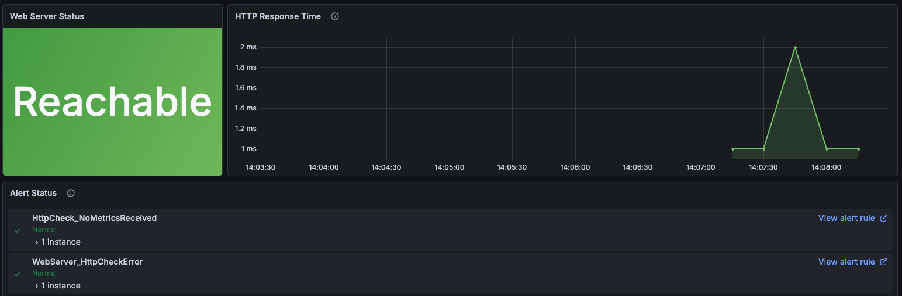
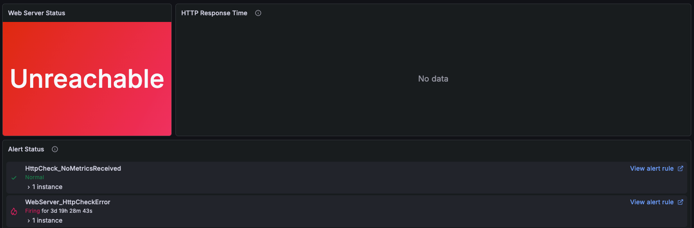

# Module 1: Configuring the Network the Old Fashioned Way

## Overview

Despite the availability of automation tools, it's still common for many network teams to SSH directly into devices to configure them manually. This approach is both laborious and error-prone, but experiencing it firsthand helps us appreciate why automation is so valuable, and why doing it right matters.

In this module, you'll manually configure network devices using the CLI, feeling the pain points that automation aims to solve. This sets the stage for the automated solutions we'll build in later modules.

## Learning Objectives

By the end of this module, you will:

- Understand the lab network topology and how devices connect
- Experience manual network configuration using SSH and CLI commands
- Configure interfaces, IP addressing, and OSPF routing manually
- Validate network connectivity using command line tools
- Recognize the challenges and risks of manual configuration at scale

## Lab Network Topology

Throughout this workshop, we'll work with a simple network topology:

```text
┌──────────────────┐                                  ┌──────────────────┐
│   Orb agent      │                                  │   Web Server     │
│                  │                                  │                  │
│ (Simulated User/ │                                  │  (Target/Server) │
│    End Client)   │                                  │                  │
└────────┬─────────┘                                  └────────┬─────────┘
         │ 192.168.1.2/30                                      │ 192.168.2.2/30
         │                                                     │ 
         │ 192.168.1.1/30                                      │ 192.168.2.1/30
         │ ethernet-1/2.0                                      │ ethernet-1/2.0
┌────────┴─────────┐             OSPF                 ┌────────┴─────────┐
│      srl1        │            Area 0                │      srl2        │
│                  │◄────────────────────────────────►│                  │
│   Router ID:     │ 10.0.0.1/30          10.0.0.2/30 │   Router ID:     │
│    1.1.1.1       │ ethernet-1/1.0    ethernet-1/1.0 │    2.2.2.2       │
└──────────────────┘                                  └──────────────────┘
```

### Topology Details

**Devices:**

- **srl1**: Nokia SR Linux router (Management IP: 172.24.0.101)
- **srl2**: Nokia SR Linux router (Management IP: 172.24.0.102)
- **web-server**: Nginx web server (192.168.2.2)
- **orb-agent**: Simulated end-user / client — performs HTTP checks against the web server to represent real user traffic (Management IP: 172.24.0.100)

**Network Design:**

- **Transit Link**: srl1 (10.0.0.1) ↔ srl2 (10.0.0.2) via ethernet-1/1
- **Routing Protocol**: OSPF v2, Area 0
- **Web Server Access**: Connected to srl2 via 192.168.2.0/30 subnet
- **Goal**: Enable srl1 to reach the web server (192.168.2.2) via an OSPF-learned route through srl2

### Initial State

The network starts in a **unconfigured state**:

- Interfaces are not enabled
- IP addresses are not assigned
- OSPF is not enabled
- Connectivity to the web server does not work

Your task: Fix it manually (so you appreciate automation later!).

## Setting Up the Lab Environment

Before we start configuring devices, we need to ensure our lab environment is running.

> [!NOTE]
> All shell commands in this module should be run from the workshop directory on your lab VM:
>
> ```bash
> cd ~/workspace/netbox-learning/autocon5-workshop
> ```

## Step 1: Set Up Environment Variables

First, set up your shell environment variables:

```bash
source ./1_set_envvars.sh
```

This sets various environment variables including `$MY_EXTERNAL_IP`, `$NETBOX_URL`, `$GRAFANA_URL`, and `$GITEA_URL` which you'll use throughout the workshop.

## Step 2: Verify the ContainerLab Network

The lab network was already started as part of the workshop provisioning. Verify all four nodes are running:

```bash
sudo containerlab inspect --all
```

You should see all four nodes in the `running` state:

```bash
╭──────────────────────────┬──────────────────────────────┬─────────┬────────────────╮
│           Name           │          Kind/Image          │  State  │ IPv4/6 Address │
├──────────────────────────┼──────────────────────────────┼─────────┼────────────────┤
│ clab-workshop-orb-agent  │ linux                        │ running │ 172.24.0.100   │
│                          │ netboxlabs/orb-agent:develop │         │ N/A            │
├──────────────────────────┼──────────────────────────────┼─────────┼────────────────┤
│ clab-workshop-srl1       │ nokia_srlinux                │ running │ 172.24.0.101   │
│                          │ ghcr.io/nokia/srlinux:24.7.2 │         │ N/A            │
├──────────────────────────┼──────────────────────────────┼─────────┼────────────────┤
│ clab-workshop-srl2       │ nokia_srlinux                │ running │ 172.24.0.102   │
│                          │ ghcr.io/nokia/srlinux:24.7.2 │         │ N/A            │
├──────────────────────────┼──────────────────────────────┼─────────┼────────────────┤
│ clab-workshop-web-server │ linux                        │ running │ N/A            │
│                          │ nginx:alpine                 │         │ N/A            │
╰──────────────────────────┴──────────────────────────────┴─────────┴────────────────╯
```

## Manually Configuring the Network

Let's configure the network by manually configuring each device.

### Configuring srl1

> [!TIP]
> **Don't worry if you're unfamiliar with the Nokia SR Linux CLI.**
> All commands are provided below. Just copy and paste them carefully.

SSH into srl1:

```bash
ssh admin@clab-workshop-srl1
```

> [!TIP]
> **Nokia SR Linux Credentials**
>
> - Username: `admin`
> - Password: `NokiaSrl1!`

Now let's configure it step by step.

### Enter Configuration Mode

```bash
enter candidate
```

This enters candidate configuration mode, where changes are staged but not yet applied.

### Configure the Default Network Instance

```bash
set / network-instance default type default
```

This creates a default VRF (Virtual Routing and Forwarding) instance.

### Configure ethernet-1/1 (Transit Link to srl2)

```bash
set / interface ethernet-1/1 admin-state enable
set / interface ethernet-1/1 subinterface 0 ipv4 address 10.0.0.1/30
set / interface ethernet-1/1 subinterface 0 ipv4 admin-state enable
```

This configures:

- Interface: `ethernet-1/1`
- IP Address: `10.0.0.1/30`
- Purpose: Point-to-point link to srl2

### Configure ethernet-1/2 (Link to Orb agent)

```bash
set / interface ethernet-1/2 admin-state enable
set / interface ethernet-1/2 subinterface 0 ipv4 address 192.168.1.1/30
set / interface ethernet-1/2 subinterface 0 ipv4 admin-state enable
```

This configures the link to the Orb agent (`192.168.1.2`), which uses this interface for network discovery and monitoring.

### Add Interfaces to Network Instance

```bash
set / network-instance default interface ethernet-1/1.0
set / network-instance default interface ethernet-1/2.0
```

This associates the interfaces with the default network instance (VRF).

### Enable OSPF

```bash
set / network-instance default protocols ospf instance main admin-state enable
set / network-instance default protocols ospf instance main version ospf-v2
set / network-instance default protocols ospf instance main router-id 1.1.1.1
```

This enables OSPF version 2 with router ID `1.1.1.1`.

### Configure OSPF Interfaces

```bash
# Enable OSPF on ethernet-1/1 (transit link)
set / network-instance default protocols ospf instance main area 0.0.0.0 interface ethernet-1/1.0 admin-state enable
set / network-instance default protocols ospf instance main area 0.0.0.0 interface ethernet-1/1.0 interface-type point-to-point

# Enable OSPF on ethernet-1/2 (passive - advertise but don't form adjacencies)
set / network-instance default protocols ospf instance main area 0.0.0.0 interface ethernet-1/2.0 admin-state enable
set / network-instance default protocols ospf instance main area 0.0.0.0 interface ethernet-1/2.0 interface-type point-to-point
set / network-instance default protocols ospf instance main area 0.0.0.0 interface ethernet-1/2.0 passive true
```

This:

- Adds both interfaces to OSPF Area 0
- Sets ethernet-1/1 as an active OSPF interface
- Sets ethernet-1/2 as passive (advertises the subnet but doesn't try to form OSPF adjacencies)

### Commit the Configuration

```bash
commit now
```

This applies all the staged changes immediately.

> [!NOTE]
> If you made any typos, the commit will fail with an error message. You can use `discard` to abandon changes and start over.

Now exit srl1 by pressing `Ctrl+D`.

### Configuring srl2

Now let's configure the second router. Notice how similar (but not identical) the configuration is: a perfect recipe for copy-paste errors.

SSH into srl2:

> [!TIP]
> **Nokia SR Linux Credentials**
>
> - Username: `admin`
> - Password: `NokiaSrl1!`

```bash
ssh admin@clab-workshop-srl2
```

Now configure srl2:

### Enter Candidate Mode

```bash
enter candidate
```

### Create the Default Network Instance

```bash
set / network-instance default type default
```

### Configure ethernet-1/1 (Transit Link to srl1)

```bash
set / interface ethernet-1/1 admin-state enable
set / interface ethernet-1/1 subinterface 0 ipv4 address 10.0.0.2/30
set / interface ethernet-1/1 subinterface 0 ipv4 admin-state enable
```

This configures the other end of the transit link:

- IP Address: `10.0.0.2/30` (peer to srl1's 10.0.0.1)

### Configure ethernet-1/2 (Web Server Network)

```bash
set / interface ethernet-1/2 admin-state enable
set / interface ethernet-1/2 subinterface 0 ipv4 address 192.168.2.1/30
set / interface ethernet-1/2 subinterface 0 ipv4 admin-state enable
```

This configures the connection to the web server:

- IP Address: `192.168.2.1/30` (web server is at 192.168.2.2)

### Associate Interfaces with Network Instance

```bash
set / network-instance default interface ethernet-1/1.0
set / network-instance default interface ethernet-1/2.0
```

### Enable OSPF on srl2

```bash
set / network-instance default protocols ospf instance main admin-state enable
set / network-instance default protocols ospf instance main version ospf-v2
set / network-instance default protocols ospf instance main router-id 2.2.2.2
```

Note the different router ID: `2.2.2.2` (vs. `1.1.1.1` on srl1).

### Configure OSPF Interfaces on srl2

```bash
# Enable OSPF on ethernet-1/1 (transit link)
set / network-instance default protocols ospf instance main area 0.0.0.0 interface ethernet-1/1.0 admin-state enable
set / network-instance default protocols ospf instance main area 0.0.0.0 interface ethernet-1/1.0 interface-type point-to-point

# Enable OSPF on ethernet-1/2 (passive - web server network)
set / network-instance default protocols ospf instance main area 0.0.0.0 interface ethernet-1/2.0 admin-state enable
set / network-instance default protocols ospf instance main area 0.0.0.0 interface ethernet-1/2.0 interface-type point-to-point
set / network-instance default protocols ospf instance main area 0.0.0.0 interface ethernet-1/2.0 passive true
```

The ethernet-1/2 interface is passive because the web server doesn't speak OSPF. We just want to advertise the 192.168.2.0/30 subnet.

### Apply the Configuration

```bash
commit now
```

Great! Now srl2 is configured. Let's verify everything works.

## Verifying the Configuration

Now let's test that our manual configuration actually works.

### Test 1: Ping from srl2

You should still be connected to `clab-workshop-srl2`. Let's verify it can reach the web server directly:

```bash
ping -c 4 network-instance default 192.168.2.2
```

**Expected output:**

```bash
Using network instance default
PING 192.168.2.2 (192.168.2.2) 56(84) bytes of data.
64 bytes from 192.168.2.2: icmp_seq=1 ttl=64 time=3.62 ms
64 bytes from 192.168.2.2: icmp_seq=2 ttl=64 time=4.09 ms
64 bytes from 192.168.2.2: icmp_seq=3 ttl=64 time=1.89 ms
64 bytes from 192.168.2.2: icmp_seq=4 ttl=64 time=2.03 ms

--- 192.168.2.2 ping statistics ---
4 packets transmitted, 4 received, 0% packet loss
```

✅ **Success!** srl2 can reach the web server (as expected, since they're directly connected).

Exit srl2 by pressing `Ctrl+D`.

### Test 2: Ping from srl1

Now for the real test: Can srl1 reach the web server through the OSPF-routed path?

SSH into srl1:

```bash
ssh admin@clab-workshop-srl1
```

Ping the web server:

```bash
ping -c 4 network-instance default 192.168.2.2
```

**Expected output:**

```bash
Using network instance default
PING 192.168.2.2 (192.168.2.2) 56(84) bytes of data.
64 bytes from 192.168.2.2: icmp_seq=1 ttl=63 time=2.09 ms
64 bytes from 192.168.2.2: icmp_seq=2 ttl=63 time=1.92 ms
64 bytes from 192.168.2.2: icmp_seq=3 ttl=63 time=1.49 ms
64 bytes from 192.168.2.2: icmp_seq=4 ttl=63 time=2.03 ms

--- 192.168.2.2 ping statistics ---
4 packets transmitted, 4 received, 0% packet loss
```

✅ **Success!** srl1 can reach the web server via OSPF routing through srl2.

### Optional: Verify OSPF Neighbors

While still on srl1, you can verify OSPF is working:

```bash
show network-instance default protocols ospf neighbor
```

You should see srl2 (10.0.0.2) as a neighbor:

```bash
Net-Inst default OSPFv2 Instance main Neighbors
+---------------------------------------------------------------------------------------+
| Interface-Name         Rtr Id            State        Pri   RetxQ    Time Before Dead |
+=======================================================================================+
| ethernet-1/1.0         2.2.2.2           full         1     0        37               |
+---------------------------------------------------------------------------------------+
No. of Neighbors: 1
```

Exit srl1 by pressing `Ctrl+D`.

### Optional: Validating with Observability

While `ping` confirmed connectivity, monitoring has been running in the background the whole time. Let's check whether the network you just configured shows up as healthy in Grafana.

> [!TIP]
> **Grafana Access**
>
> - URL: `https://grafana-<YOUR_ID>.autocon5.netboxlabs.tech`
> - Username: `admin`
> - Password: `netboxlabs`

1. Open Grafana in your browser
2. Navigate to **Dashboards** and open **Workshop Network Observability**
3. Look at the **Web Server Status** panel

You should see 🟢 **Reachable** — monitoring agrees with `ping`!



> [!NOTE]
> If you see 🔴 **Unreachable**, check that you committed the configuration on both `srl1` and `srl2`. If you still can't resolve it, don't worry — Module 3 will deploy the correct configuration automatically.
>
> 

## Key Takeaways

**Manual configuration doesn't scale and isn't safe.**

- **Error-prone by design**: Typing similar commands across multiple devices with slight variations is a reliable recipe for mistakes — wrong IPs, mismatched subnet masks, incorrect router IDs. One typo breaks the network.
- **No feedback loop**: You had to manually test with ping. There was no automatic verification that the configuration you intended was the configuration you deployed.
- **Documentation lags behind reality**: Nothing you did here was tracked. If something breaks tomorrow, there's no record of what changed or when.
- **Automation needs a reliable source of truth**: The manual approach has no single place that describes what the network *should* look like. Without that, automation has nothing to deploy from — and nothing to compare reality against.

## Resetting to Baseline

To ensure everyone starts the next modules from the same state, let's reset the network to its original unconfigured state.

> [!TIP]
> If prompted with `Are you sure you want to remove all labs listed above? Enter 'y', to confirm or ENTER to abort:`, type `y` and press Enter.

```bash
./reset_network.sh
```

> [!NOTE]
> ContainerLab will print a warning listing the existing lab it is about to remove — this is expected. The reset takes 1–2 minutes to complete; wait for it to finish before proceeding.

This tears down the existing lab and rebuilds all containers in their initial (unconfigured) state. After a couple of minutes you should see all four nodes running again:

```bash
╭──────────────────────────┬──────────────────────────────┬─────────┬────────────────╮
│           Name           │          Kind/Image          │  State  │ IPv4/6 Address │
├──────────────────────────┼──────────────────────────────┼─────────┼────────────────┤
│ clab-workshop-orb-agent  │ linux                        │ running │ 172.24.0.100   │
│                          │ netboxlabs/orb-agent:develop │         │ N/A            │
├──────────────────────────┼──────────────────────────────┼─────────┼────────────────┤
│ clab-workshop-srl1       │ nokia_srlinux                │ running │ 172.24.0.101   │
│                          │ ghcr.io/nokia/srlinux:24.7.2 │         │ N/A            │
├──────────────────────────┼──────────────────────────────┼─────────┼────────────────┤
│ clab-workshop-srl2       │ nokia_srlinux                │ running │ 172.24.0.102   │
│                          │ ghcr.io/nokia/srlinux:24.7.2 │         │ N/A            │
├──────────────────────────┼──────────────────────────────┼─────────┼────────────────┤
│ clab-workshop-web-server │ linux                        │ running │ N/A            │
│                          │ nginx:alpine                 │         │ N/A            │
╰──────────────────────────┴──────────────────────────────┴─────────┴────────────────╯
```

The **Web Server Status** panel in Grafana should now show 🔴 **Unreachable** — confirming the reset worked and monitoring detected the broken state automatically.

## What's Next?

In **Module 2**, we'll plan the deployment in NetBox — site, rack, devices, cabling, and management addressing — staged in a branch and reviewed before going live. By the end you'll have a source of truth that automation can read from.

> [!NOTE]
> **Coming up: Event-Driven Automation**
>
> From Module 3 onwards, you'll use **Event-Driven Ansible (EDA)** to automate network operations. Instead of typing commands device by device, a single click in NetBox will trigger an Ansible playbook that configures all devices simultaneously — and validates the result. Keep that in mind as you work through the manual steps ahead.

---

**Continue to:** [Module 2 - Planning Your Deployment in NetBox](../module_2/README.md)
  