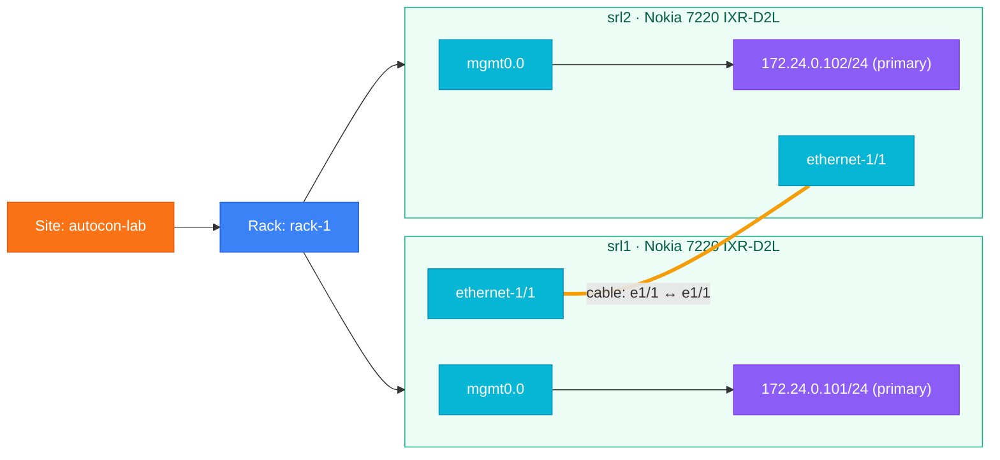
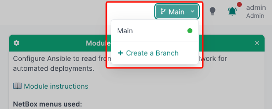
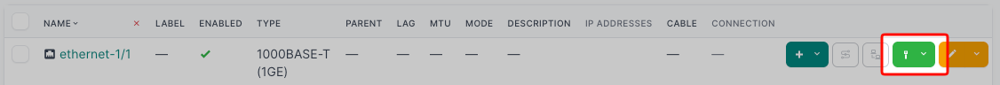
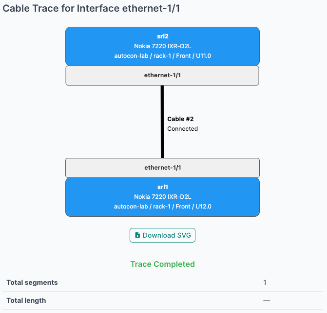

# Module 2: Planning Your Deployment in NetBox

## Overview

In Module 1 you configured the network by hand, watched it light up green in Grafana, and then tore everything back down to a clean baseline. The lab is up, the devices are reachable on their management IPs, but they're unconfigured — and **NetBox is empty**.

You're now in the position every team is in the day they start using NetBox: there's a network in front of you (here, in your container lab), and a fresh source of truth waiting for a design. NetBox isn't just a database — it's where you express **what the network is supposed to be**. Site layout, rack elevation, device placement, cabling plan, addressing scheme: every one of those is **design intent** that automation will later use to drive real configuration.

In this module you'll capture that intent from scratch. You'll plan and model a small site: create the site, rack the devices, import a device type, place two routers, cable them together, and assign management IPs — the same flow you'd use to spec a new branch office or a data-center pod before the gear is even racked. Because this is a design exercise, every change lands in a **NetBox branch** first; at the end you'll review the complete change set and merge it to main as one coherent deployment.

> [!NOTE]
> **Why model the design first?**
> In a real deployment, your inventory and addressing plans usually exist *before* the hardware does — you spec'd what to buy against a design, and the IP plan was reviewed long before the first cable went in. Capturing intent first means NetBox is the source of truth from day one, not a downstream copy of whatever the network happens to look like. We'll use discovery at the end as a **verification** step — confirming the deployed network matches the design.

This approach borrows the structure of the [NetBox Zero to Hero](https://github.com/netbox-community/netbox-zero-to-hero) course — site → rack → kit → connections → IPs — collapsed down to fit our two-device lab and wrapped in a planning-branch workflow.

## Learning Objectives

By the end of this module, you will:

- Use a NetBox **branch** to stage a complete site design before committing to main
- Understand the core NetBox data model: **sites, racks, device types, devices, cables, and IP addresses**
- Import a device type from a YAML definition (the [NetBox Device Type Library](https://github.com/netbox-community/devicetype-library) pattern)
- Create devices with the correct manufacturer, model, and interface inventory
- Cable devices together so NetBox knows how the topology is wired
- Assign management IP addresses and mark them as primary
- Review a change set and merge it to main as a single deployment
- Use NetBox Discovery to **verify** the deployed network matches the design

## What We're Building

A minimal but complete representation of the lab in NetBox, staged inside a planning branch and merged at the end:



<!-- -->
> [!NOTE]
> The lab also includes an **orb-agent** and a **web-server** container, but those aren't network devices we'd typically model in NetBox (they're hosts, not routers/switches). We're scoping NetBox to what a network team typically cares about: the SR Linux routers, their links, and their management addresses.

## Before You Start

Make sure NetBox is reachable.

> [!TIP]
> **NetBox Access**
>
> - URL: `https://netbox-<YOUR_ID>.autocon5.netboxlabs.tech`
> - Username: `admin`
> - Password: `netboxlabs`

You should see the workshop dashboard with the six module cards and a **Change Log** at the bottom showing **— No object changes found —**. That confirms NetBox is empty and ready.

<!-- -->
> [!TIP]
> **Gitea Access** (for the device type import in Step 4)
>
> - URL: `https://gitea-<YOUR_ID>.autocon5.netboxlabs.tech`
> - Username: `admin`
> - Password: `netboxlabs`

You should see the Gitea dashboard with the `admin/workshop-resources` repository listed. That's where the device type definitions and workshop scripts live.

## Step 1: Create and Activate a Planning Branch

> [!IMPORTANT]
> **NetBox Concept: Branching**
>
> A **branch** is an isolated copy of the NetBox database you can edit freely without affecting the live data that automation tools and other teams read from. It works like a Git branch for your source of truth: make all your changes inside the branch, review the complete diff, and merge to main when you're confident. If something looks wrong, discard the branch — main is untouched.

Every change in this module — site, rack, device type, devices, cables, IPs — will land in a branch called `module-2-site-planning`. We'll review the complete change set and merge it to main at the end.

### Create the Branch

1. Click the **Main** dropdown in the top-right corner of any NetBox page

   

2. Click **+ Create a Branch**
3. **Name**: `module-2-site-planning`
4. Click **Create**

You'll land on the branch detail page with the status initially showing as **New**.

> [!NOTE]
> Wait until the **Status** field shows `Ready` before proceeding — usually 30–60 seconds. Refresh the page after ~10 seconds if the status hasn't updated.

### Switch into the Branch

Once the status shows `Ready`, use the branch selector to put your session into the branch:

1. Click the **Main** dropdown in the top-right corner of any NetBox page
2. Select `module-2-site-planning` from the list
3. The dropdown now shows `module-2-site-planning` instead of **Main**

> [!NOTE]
> Use the top-right dropdown to switch branches — not the **Activate** button on the branch detail page. The dropdown is what scopes your session to the branch; the Activate button has a different purpose and may not update your navigation context reliably.

From this point on, every change you make in NetBox lands in the branch.

## Step 2: Create the Site

Every physical thing in NetBox lives inside a **site**. A site is typically a building or a data center; for the workshop, it's our container lab.

1. In NetBox, navigate to **Organization** → **Sites**
2. Click **+ Add** (top right)
3. Fill in the form:
   - **Name**: `autocon-lab`
   - **Slug**: `autocon-lab` (auto-fills from the name)
   - **Status**: `Active`
   - **Description** *(optional)*: `Workshop ContainerLab environment`
4. Leave everything else at the defaults
5. Click **Create**

You should land on the site detail page for `autocon-lab`. Notice the **Related Objects** sidebar on the right — it's empty right now (no racks, no devices, no prefixes). We'll fix that.

> [!NOTE]
> **What about regions, site groups, tenants?**
> NetBox has a richer organizational hierarchy — regions for geography (continent → country → city), site groups for functional buckets (branch, corporate), tenants for ownership. The [Zero to Hero Module 2](https://github.com/netbox-community/netbox-zero-to-hero/blob/main/modules/2-setting-up-the-organization/2-setting-up-the-organization.md) walks through all of them. We're skipping the upper levels for the workshop because a single site is plenty for two routers — but in production you'd use these to scale across dozens or thousands of locations.

## Step 3: Create the Rack

Even though our "devices" are containers, we still model them as if they were rack-mounted hardware. That gives us position, height, and a parent location to attach cables to.

1. In NetBox, navigate to **Racks** → **Racks**
2. Click **+ Add**
3. Fill in:
   - **Site**: `autocon-lab`
   - **Name**: `rack-1`
   - **Status**: `Active`
   - **Width**: `19 inches`
   - **Height (U)**: `12`
4. Click **Create**

Open the rack detail page. You'll see a tall empty rack diagram on the right — that's where the devices will appear once we add them in Step 6.

## Step 4: Import the Device Type

A **device type** is the template for a piece of hardware: manufacturer, model, height in rack units, all of its interfaces, console ports, power inlets, and so on. Defining it once means every device you create from it inherits the full interface inventory automatically — you don't have to type out 50+ interface names every time you add a new switch.

The community maintains a huge open-source catalog at [netbox-community/devicetype-library](https://github.com/netbox-community/devicetype-library). For the workshop we've mirrored a small curated subset into the **local Gitea** server.

### Grab the Nokia 7220 IXR-D2L Definition

1. Open Gitea in your browser (see the access block above)
2. Click **Sign In** (top right)
3. In the repositories section (upper right of the screen), browse to **admin / workshop-resources**
4. Click `device-types`, then `Nokia`, then `7220-IXR-D2L.yaml`
5. Click the **copy content icon** (two overlapping squares, top-right of the file view) to copy the file contents to your clipboard

You'll see something like this at the top:

```yaml
---
manufacturer: Nokia
model: 7220 IXR-D2L
slug: nokia-7220-ixr-d2l
part_number: 3HE13884AARA01
u_height: 1
is_full_depth: true
...
interfaces:
  - name: mgmt0
    type: 1000base-t
    mgmt_only: true
  - name: ethernet-1/1
    type: 25gbase-x-sfp28
  - name: ethernet-1/2
    type: 25gbase-x-sfp28
  ...
```

> [!NOTE]
> Real Nokia SR Linux runs on this exact platform. Our ContainerLab nodes simulate it. The fact that we can model "what we'd buy" identically to "what we run" is one reason device types are useful — they describe hardware intent independent of whether the box is physical, virtual, or containerized.

### Create the Nokia Manufacturer

The NetBox device-type YAML import expects the manufacturer to already exist — it won't auto-create one and the import will fail with an error like *"Manufacturer Nokia doesn't exist"* if it's missing. So we add it first:

1. In NetBox, navigate to **Devices** → **Manufacturers**
2. Click **+ Add**
3. Fill in:
   - **Name**: `Nokia`
   - **Slug**: `nokia` (auto-fills)
4. Click **Create**

### Import the Device Type definition

1. In NetBox, navigate to **Devices** → **Device Types**
2. Click the **Import** button (looks like an underlined upward arrow) — *not* **+ Add**
3. In the **Data** text area, paste the YAML you copied from Gitea
4. Click **Submit**

NetBox now:

- Creates the **Device Type** `7220 IXR-D2L`, linking it to the `Nokia` manufacturer you just added
- Pre-creates all the **interface templates**, **console port templates**, and so on, attached to that device type

Verify it worked:

1. Open the new **7220 IXR-D2L** device type
2. Click the **Interfaces** tab
3. You should see `mgmt0`, `ethernet-1/1` through `ethernet-1/58`, plus the console port — all 59+ interface and port templates

## Step 5: Create a Device Role

A **device role** is a label that describes what a device does in the network: edge router, spine, leaf, firewall, access switch. NetBox requires every device to have a role.

1. Navigate to **Devices** → **Device Roles**
2. Click **+ Add**
3. Fill in:
   - **Name**: `Router`
   - **Slug**: `router`
   - **Color**: pick anything — `Blue` is a sensible default
4. Click **Create**

> [!TIP]
> In a real network you'd typically have several roles (`edge`, `core`, `spine`, `leaf`, `mgmt-switch`, `firewall`, …) so reports and dashboards can filter by function. One role is plenty for our two routers.

## Step 6: Add the Devices

Now we have everywhere a device *could* live (site, rack), everything we need to *describe* a device (device type, device role), and we're ready to actually place the routers.

### Add srl1

1. Navigate to **Devices** → **Devices**
2. Click **+ Add**
3. Fill in:
   - **Name**: `srl1`
   - **Device Role**: `Router`
   - **Device Type**: `7220 IXR-D2L` (Manufacturer auto-populates to `Nokia`)
   - **Site**: `autocon-lab`
   - **Rack**: `rack-1`
   - **Face**: `Front`
   - **Position (U)**: `U12`
   - **Status**: `Active`
4. Click **Create**

Open the new `srl1` page. Notice that the **Interfaces** tab is *already populated* with all the interfaces (`mgmt0`, `ethernet-1/1` through `ethernet-1/58`) — they were cloned from the device type's interface templates the moment you created the device. This is the payoff for taking the time to import the device type properly: zero typing of interface names per device.

### Add srl2

Repeat with one difference (position):

1. Navigate to **Devices** → **Devices** → **+ Add**
2. Fill in:
   - **Name**: `srl2`
   - **Device Role**: `Router`
   - **Device Type**: `7220 IXR-D2L`
   - **Site**: `autocon-lab`
   - **Rack**: `rack-1`
   - **Face**: `Front`
   - **Position (U)**: `U11`
   - **Status**: `Active`
3. Click **Create**

Now jump back to **Racks** → **Racks** → `rack-1`. You should see both devices at the top of the rack elevation diagram — `srl1` at U12, `srl2` at U11 just below it. Two real network devices, modeled correctly, with zero typing of interface names.

## Step 7: Connect the Cables

Devices on their own aren't a network — you need to tell NetBox how they're physically connected. The container lab wires `srl1:ethernet-1/1` directly to `srl2:ethernet-1/1`. Let's model that cable.

### Cable srl1 ↔ srl2

1. Open the `srl1` device page
2. Click the **Interfaces** tab
3. Find `ethernet-1/1` in the list
4. On the right side of the row, click the **green cable icon dropdown** and select **Interface**

   
5. On the **Connect Cable** form:
   - **Side B Device**: `srl2`
   - **Side B Interface**: `ethernet-1/1`
   - **Type**: `Direct Attach Copper (Passive)`
   - **Status**: `Connected`
6. Click **Create**

You'll be returned to the `srl1` interfaces page. `ethernet-1/1` should now show a **cable badge** in the **Connection** column.

### Verify with Cable Trace

Click the dark green cable badge on `ethernet-1/1` to open the cable trace view, then confirm both ends are wired correctly:



That's our single inter-router link modeled.

> [!TIP]
> **NetBox cables drive LLDP validation.** The cable you just created is how the automated network validator in Module 3 knows which neighbors to *expect* on each device. Once this branch is merged to main, the `validate_network` playbook will query the NetBox cables API and cross-reference it against what LLDP reports on the wire — giving you an objective PASS or FAIL rather than a manual inspection.

<!-- -->
> [!NOTE]
> **What about the cables to orb-agent and web-server?**
> Those run between an SR Linux router and a Linux host. In a real production model you might create the host as a `Virtual Machine` or as a `Generic` device and cable to it. We're skipping it here to keep the module short — the inter-router cable is the one we'll need to verify with LLDP in Module 3.

## Step 8: Add Management IP Addresses

The last piece of the model: tell NetBox what IP each device uses for management. This is what Ansible will read out of NetBox in Module 3 to know where to SSH to.

> [!NOTE]
> **A quirk of the SR Linux data model.** SR Linux assigns IP addresses to **subinterfaces** (named `<parent>.<n>`), not to the physical interface itself. The CLI you saw in Module 1 — `set / interface ethernet-1/1 subinterface 0 ipv4 address 10.0.0.1/30` — actually puts the IP on `ethernet-1/1.0`, a virtual child of `ethernet-1/1`. The same pattern applies to `mgmt0`, so we'll model **`mgmt0.0`** as a subinterface and put the management IP there. Modules 4 and 5 will use the same pattern for the data-plane interfaces.

### Add a mgmt0.0 Subinterface on srl1

1. Open `srl1` → **Interfaces** tab
2. Click **Add Components** → **Interfaces**
3. Fill in:
   - **Name**: `mgmt0.0`
   - **Type**: `Virtual`
   - **Parent interface**: `mgmt0`
4. Click **Create**

You should now see `mgmt0.0` in the interface list, with `mgmt0` shown as its parent.

### Add 172.24.0.101 on srl1's mgmt0.0

1. Still on the **Interfaces** tab of `srl1`, find `mgmt0.0` in the list
2. Click the green **+** dropdown button on the right side of the `mgmt0.0` row
3. Select **IP Address**
4. Fill in:
   - **Address**: `172.24.0.101/24`
   - **Status**: `Active`
   - **Interface**: `mgmt0.0` (should be pre-filled)
   - Check **Make this the primary IP for the device/VM**
5. Click **Create**

On the device summary page you should now see **Primary IPv4: 172.24.0.101** — this is the field tools like Ansible read when connecting to the device.

### Repeat for srl2

Same flow on the second router:

1. `srl2` → **Interfaces** → **Add Components** → **Interfaces** → Name `mgmt0.0`, Type `Virtual`, Parent `mgmt0` → **Create**
2. Find `mgmt0.0` in the list → click the green **+** dropdown → **IP Address**
3. Fill in `172.24.0.102/24`, **Status** `Active`, check **Make this the primary IP for the device/VM** → **Create**

### Sanity Check (inside the branch)

Navigate to **Devices** → **Devices**. You should still see the active branch name in the NetBox header — these listings are what your design looks like *inside the branch*:

| Name | Status | Site        | Rack   | Role   | Type         | IP Address      |
|------|--------|-------------|--------|--------|--------------|-----------------|
| srl1 | Active | autocon-lab | rack-1 | Router | 7220 IXR-D2L | 172.24.0.101/24 |
| srl2 | Active | autocon-lab | rack-1 | Router | 7220 IXR-D2L | 172.24.0.102/24 |

The design is complete. Main is still untouched — every change you made lives in the branch. Time to review and merge.

## Step 9: Review and Merge the Branch

Everything you've built so far — the site, the rack, the device type and its 59 interface templates, both devices and all their inherited interfaces, the cable, the two management IPs — lives inside the `module-2-site-planning` branch. Before Module 3's automation can read this data from main, the branch needs to merge.

### Review the Change Set

1. Navigate to **Branching** → **Branches** → `module-2-site-planning`
2. Click the **Changes Ahead** tab

You should see entries for the site, rack, manufacturer, device type, role, two devices, every cloned interface, the two `mgmt0.0` subinterfaces you added, the cable, and the two IP addresses. Click into any row to see exactly what's being added.

This is your design review. In a real deployment you'd circulate this list to a peer or a change-board for approval before merging.

### Merge to Main

1. From the branch page, click **Merge** (top right)
2. Check the **Commit Changes** checkbox (leave it unchecked to perform a dry run instead)
3. **Merge Strategy**: leave it set to `Iterative`
4. Click **Merge Branch**

> [!NOTE]
> The merge can take a minute or two as NetBox applies every change to main. Refresh the page to watch the status progress.

Once the branch status shows `Merged`:

1. Navigate to **Organization** → **Sites** — `autocon-lab` is now in main
2. Navigate to **Devices** → **Devices** — `srl1` and `srl2` are listed with their primary IPv4s filled in

Your design is now in main — the default source of truth. Tools reading NetBox without specifying a branch will see this picture, which is why merging is the gate before automation runs against it.

> [!NOTE]
> **Coming up in Module 3:** Once you've set up the workshop scripts (Step 10 below), you'll run a network validation that uses your NetBox design as the source of truth. CHECK 2 — LLDP Neighbors will pass immediately because the cable you just merged is now visible to the validator.

## Step 10: Verify with NetBox Discovery

> [!IMPORTANT]
> **NetBox Concept: Diode and Orb agent**
>
> **Diode** is a data ingestion service that receives network state from the **Orb agent** — which actively discovers device inventory, interfaces, and IP addresses by connecting directly to devices — and writes that data into NetBox. Rather than manually documenting what's on the wire, discovery lets the network describe itself. Used here as a **verification** step: after deploying from intent, we run discovery to confirm the live network matches what NetBox says it should be.

You designed the network from intent and merged it to main. But does the deployed network actually match the design? In a real greenfield rollout, you'd want a second pair of eyes — and that's exactly what discovery gives you.

Here's how the verification flow works:

1. A **Custom Script** in NetBox (`run_orb_discovery.py`) reads the device inventory and generates an Orb discovery policy — so the policy always reflects exactly what's in NetBox
2. The script is stored in the `workshop-resources` Gitea repo and loaded into NetBox via a **Data Source**, with no copy-pasting of code into the UI
3. Running the script pushes the policy to Gitea and signals Orb to run discovery — each script run is an on-demand trigger; Orb connects to the devices and sends the discovered state to **Diode**
4. Diode ingests the results into a **separate verification branch** so you can compare actual state to intent before accepting any changes

We'll set up the Data Source and register the scripts first, then point Orb at the devices and inspect what it finds.

### Create a Verification Branch

1. Navigate to **Branching** → **Branches** → **+ Add**
2. **Name**: `module-2-discovery-verify`
3. Click **Create**
4. Wait until **Status** shows `Ready` (30–60 seconds, refresh as needed)

### Route Discoveries to the Branch

1. Navigate to **Diode** → **Settings** → pen icon (top right)
2. **Branch**: select `module-2-discovery-verify`
3. Click **Save**

### Connect NetBox to Gitea: Setting Up a Data Source

> [!IMPORTANT]
> **NetBox Concept: Data Sources**
>
> A **Data Source** is a connection from NetBox to an external file repository — typically a Git repo. Once connected, NetBox can synchronise scripts, config templates, and device type definitions directly from version control. Every resource that runs in NetBox has a full Git audit trail: reviewed via pull requests, rolled back with `git revert`, and always in sync with what's in the repo — no copy-pasting code into text boxes.

Before we can generate the discovery policy, the script needs to be registered in NetBox — and for that, NetBox needs to know where to find it.

Once connected, NetBox can:

- **Synchronize** the repository contents on demand (or automatically via webhook)
- **Serve scripts directly from synced files** — no copy-pasting code into a text box in the UI
- **Track versions** — every sync records the commit SHA, so you always know exactly which version of a script is loaded
- **Pick up updates instantly** — push a new version to Git, click Sync, and NetBox runs the new code immediately

This matters a lot in practice. Without Data Sources, every time you update a script you have to manually paste the new code into the NetBox UI — it's error-prone, bypasses code review, and leaves no audit trail of what changed or when. With a Data Source, scripts live in Git where they can be reviewed via pull requests, tested on branches, rolled back with `git revert`, and audited by commit history. The same file that's reviewed in Git is the file that runs in NetBox — no manual upload step in between.

The same pattern applies to **Config Templates** (the Jinja2 templates you'll use in Modules 4 and 5): rather than pasting template code into NetBox, you can store templates in Git and have NetBox render them directly from the synced source. Change the template, sync, and the next rendered config reflects the update — with a full Git history of every change.

In this workshop, the `workshop-resources` Gitea repository contains:

| Path | Purpose |
| ---- | ------- |
| `scripts/run_orb_discovery.py` | Generates an Orb discovery policy YAML from NetBox data |
| `scripts/trigger_eda.py` | Fires events to Ansible EDA and streams results back |
| `scripts/branch_change_summary.py` | Summarizes meaningful changes in a branch, filtering out no-op Diode updates |
| `config-templates/srl_interfaces.j2` | Jinja2 template for SR Linux interface configuration (Module 4) |
| `config-templates/srl_interfaces_ospf.j2` | Extended template including OSPF (Module 5) |
| `device-types/` | Device type YAML definitions (you used these in Step 4) |

We'll connect NetBox to this repository now and register the scripts.

#### Add the Data Source

1. In NetBox, navigate to **Operations** → **Data Sources**
2. Click **+ Add** (top right)
3. Fill in:
   - **Name**: `workshop-resources`
   - **Type**: `Git`
   - **Source URL**: `https://gitea-<YOUR_ID>.autocon5.netboxlabs.tech/admin/workshop-resources.git`
   - **Ignore Rules**: enter each pattern on its own line:

     ```text
     *.md
     *.png
     ```

4. Click **Create**

> [!NOTE]
> **Ignore Rules** follow `.gitignore` pattern syntax. Adding `*.md` tells NetBox to skip all Markdown files during sync — they're documentation for humans, not resources NetBox needs to load. The same pattern applies to any files in the repo that aren't scripts, templates, or device types.

<!-- -->
> [!NOTE]
> **Sync Interval** is left blank here — we'll trigger syncs manually during the workshop. In production you'd set an interval (e.g. `3600` seconds) so NetBox polls the repo automatically and scripts and templates stay current without anyone having to remember to click Sync.

#### Sync the Repository

1. On the `workshop-resources` Data Source detail page, click **Sync** (top right)
2. NetBox clones the Gitea repository and indexes every file it finds

> [!NOTE]
> The sync completes in a few seconds. Refresh the page and check the **Status** field — it should show `Completed` with a timestamp and the latest commit SHA from Gitea. If it shows `Failed`, double-check the Source URL and ensure Gitea is reachable.

Once the sync completes, click the **Files** tab on the Data Source page. You should see a complete listing of the repository contents including the `scripts/` and `config-templates/` directories.

#### Register the Custom Scripts

> [!IMPORTANT]
> **NetBox Concept: Custom Scripts**
>
> **Custom Scripts** are Python scripts that run inside NetBox with full access to its data model. They appear under **Customization → Scripts** and can be triggered manually from the UI or via webhook. In this workshop, scripts are loaded from the `workshop-resources` Data Source — so updating a script means committing to Git and syncing, with no manual UI editing required.

With the files synced, register the script so NetBox can run it:

1. Navigate to **Customization** → **Scripts**
2. Click **+ Add** (top right)
3. Fill in:
   - **Data Source**: `workshop-resources`
   - **File Path**: `scripts/run_orb_discovery.py`
   - Check **Auto sync enabled**
4. Click **Create**

You should now see **Run Orb Discovery** listed on the Scripts page.

> [!TIP]
> **The Git-backed workflow in action.** Try editing one of the scripts in Gitea (even just adding a comment), commit the change, then go to **Core** → **Data Sources** → `workshop-resources` → **Sync**. Reload the script in NetBox — it's already running the new version. This is the same pattern used in production: the review happens in Git, the deployment is a single sync.

<!-- -->
> [!NOTE]
> The `Run Orb Discovery` script is used again in Module 6 for drift detection. Additional scripts (`trigger_eda.py`, `branch_change_summary.py`) are registered in the modules where they are first needed.

### Generate the Discovery Policy from NetBox

The discovery policy file (`srl_devices.yaml`) isn't shipped with the workshop — we generate it from NetBox. That way the policy always reflects your current source of truth: add a device to NetBox, re-run the script, and the Orb agent picks it up automatically. A NetBox custom script handles the rendering and commits the result to Gitea.

1. In NetBox, navigate to **Customization** → **Scripts**
2. Click on **Run Orb Discovery**
3. Select **Site**: `autocon-lab`
4. Select **Device Role**: `Router`
5. Leave **Activate policy** checked (it's on by default)
6. Leave **Dry run** unchecked
7. Click **Run Script**

The script queried NetBox for active Nokia devices with role `Router` in `autocon-lab`, rendered an Orb discovery policy from a Jinja template, and committed the result to Gitea at `admin/orb-policies/srl_devices.yaml`. Because **Activate policy** is on by default, it also updated `selector.yaml` to add the `srlinux_discovery` block — the Orb agent will pick up the new policy without any manual Gitea editing.

Open Gitea and look at the new files. In `srl_devices.yaml`, note the `DO NOT EDIT BY HAND` header — the file is machine-generated, and the `hostname` entries in the `scope:` list match the primary IPv4s you set in Step 8. In `selector.yaml`, you'll see the `srlinux_discovery` block was appended automatically.

> [!TIP]
> **Try the loop.** Change a primary IPv4 in NetBox (or add a new device) and re-run the script. Every run increments the version number in `srl_devices.yaml` (e.g. `#-- version 2`), which signals the Orb agent to re-evaluate the policy even if the device list hasn't changed. NetBox is the source of truth; the policy file is just a projection of it.

The Orb agent polls Gitea every minute or so; within 1–2 minutes it'll load the updated `srl_devices.yaml` and start discovering `srl1` and `srl2`.

### Inspect the Results

#### Register the Branch Change Summary Script

Rather than manually scrolling through ~125 branch entries, use the `branch_change_summary.py` script to filter out no-op Diode updates and surface only the meaningful changes:

1. Navigate to **Customization** → **Scripts**
2. Click **+ Add** (top right)
3. Fill in:
   - **Data Source**: `workshop-resources`
   - **File Path**: `scripts/branch_change_summary.py`
   - Check **Auto sync enabled**
4. Click **Create**

#### Run the Summary

1. Navigate to **Customization** → **Scripts** → **Branch Change Summary**
2. Select **Branch**: `module-2-discovery-verify`
3. Leave the **Commit** checkbox unchecked
4. Click **Run Script**

The output will show only the changes that matter — created objects, updated fields, and deletions — with no-op Diode updates filtered out:

```text
========================================================================
  Branch Change Summary: module-2-discovery-verify
========================================================================
  5 created  |  0 updated  |  0 deleted  (120 no-op updates filtered out)

------------------------------------------------------------------------
  CREATED (5)
------------------------------------------------------------------------
  Object Type         Name
  ------------------  ----------------------------
  dcim | platform     NOKIA_SRL v24.7.2
  ipam | ip address   fe80::2c4a:afff:feb7:6142/64
  ...
```

#### Explore the Branch

1. **Branching** → **Branches** → `module-2-discovery-verify` → **Changes Ahead** tab
2. Click **Activate** to step inside the branch
3. Navigate to **Devices** → **Devices** and compare what discovery sees against the design you merged in Step 9:
   - Does the **device type / model** match the one you imported?
   - Are the **interfaces** the same set you got from the device-type template?
   - Did discovery find any **IPs you didn't enter** (e.g., the `mgmt0.0` IPv6 link-local address it learned by talking to the device)?

This is the real story of brownfield vs. greenfield. The **device type library** describes what the spec sheet says the hardware has. **Discovery** describes what's actually deployed. When the two agree, you have high confidence the design matches reality. When they don't, you have a conversation worth having.

### Merge

If discovery agrees with your design — and adds nothing you don't want — merge the verification branch:

1. Back on the branch page, click **Merge** → check **Commit Changes** → leave **Merge Strategy** as `Iterative` → **Merge Branch**

If discovery reports something unexpected and you'd rather keep main untouched, just leave the branch unmerged or discard it. That's the whole point of branching — you get to look before you commit.

## Key Takeaways

1. **Branches are how you stage a design.** Every change in this module went into one planning branch, was reviewed as a coherent change set, and merged only when it was complete. The same workflow scales from "model a new site" to "roll out a config change across hundreds of devices."

2. **NetBox is built top-down: site → rack → device type → device → cable → IP.** Each layer is the parent for the next. This hierarchy is what makes the data queryable later.

3. **Device types are the multiplier.** Importing one well-formed YAML gave us 59 interface and port templates, ready to clone onto every new device of that model. The community library exists so you don't have to write these yourself.

4. **Primary IPs matter for automation.** "Primary IPv4" on the device is the field every downstream tool — Ansible inventory, monitoring, change automation — reads to know where to connect. Set it deliberately.

5. **Design first; verify with discovery.** Greenfield deployments are planned before they exist. Discovery is the verification step that confirms reality matches the design — run in a separate branch so you can look before you commit.

## What's Next?

NetBox now knows what your network *is* — or more precisely, what you've designed it to be. In **Module 3** you'll connect Ansible to NetBox using the **NetBox dynamic inventory plugin** — meaning Ansible will read the devices, primary IPs, and interfaces you just modeled and use them as its inventory. You'll then run a health-check playbook against `srl1` and `srl2` to confirm Ansible can actually reach them, and (in a forward look at Module 3's cable verification) compare what NetBox says is cabled to what LLDP sees on the wire.

---

**Continue to:** [Module 3 — Automated Configuration Deployment with Ansible](../module_3/README.md)
